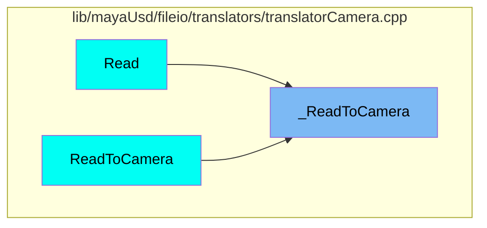
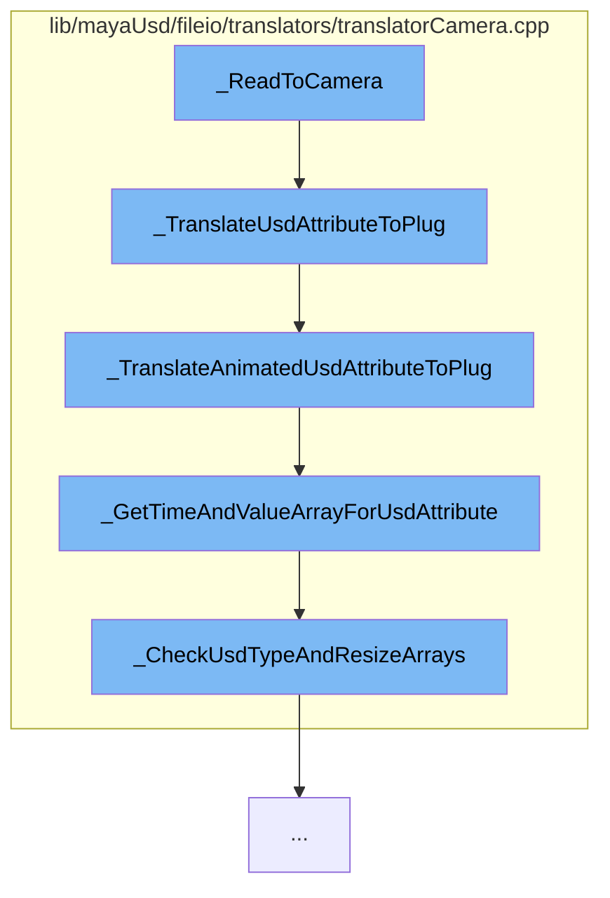

This document will cover the process of translating USD attributes to Maya camera attributes, which includes:

1. Reading USD attributes to Maya camera
2. Translating USD attributes to Maya plug
3. Translating animated USD attributes to Maya plug
4. Getting time and value array for USD attribute
5. Checking USD type and resizing arrays.

## Where is this flow used?

The flow starts with the function `_ReadToCamera`. It is called from multiple entry points as represented in the following diagram:



## The flow itself



<SwmSnippet path="lib/mayaUsd/fileio/translators/translatorCamera.cpp" line="48">

---

# Reading USD attributes to Maya camera

The function `_ReadToCamera` is the entry point for translating USD attributes to Maya camera attributes. It calls the `_TranslateUsdAttributeToPlug` function to start the translation process.

```
static bool _ReadToCamera(
    const UsdGeomCamera&         usdCamera,
    MFnCamera&                   cameraObject,
    const UsdMayaPrimReaderArgs& args,
    UsdMayaPrimReaderContext*    context);
```

---

</SwmSnippet>

<SwmSnippet path="/lib/mayaUsd/fileio/translators/translatorCamera.cpp" line="272">

---

# Translating USD attributes to Maya plug

The function `_TranslateUsdAttributeToPlug` translates the USD attribute to a Maya plug. If the attribute has animation, it calls `_TranslateAnimatedUsdAttributeToPlug` to handle the animation. If not, it sets a static value for the plug.

```c++
static bool _TranslateUsdAttributeToPlug(
    const UsdAttribute&          usdAttr,
    const MFnCamera&             cameraFn,
    const TfToken&               plugName,
    const UsdMayaPrimReaderArgs& args,
    UsdMayaPrimReaderContext*    context,
    const MDistance::Unit        convertToUnit = MDistance::kMillimeters)
{
    MStatus status;

    MPlug plug = cameraFn.findPlug(plugName.GetText(), true, &status);
    CHECK_MSTATUS_AND_RETURN(status, false);

    // First check for and translate animation if there is any.
    if (!_TranslateAnimatedUsdAttributeToPlug(usdAttr, plug, args, context, convertToUnit)) {
        // If that fails, then try just setting a static value.
        UsdTimeCode timeCode = UsdTimeCode::EarliestTime();
        float       attrValue;
        usdAttr.Get(&attrValue, timeCode);

        switch (convertToUnit) {
```

---

</SwmSnippet>

<SwmSnippet path="/lib/mayaUsd/fileio/translators/translatorCamera.cpp" line="207">

---

# Translating animated USD attributes to Maya plug

The function `_TranslateAnimatedUsdAttributeToPlug` handles the translation of animated USD attributes. It calls `_GetTimeAndValueArrayForUsdAttribute` to get the time and value arrays for the attribute.

```c++
static bool _TranslateAnimatedUsdAttributeToPlug(
    const UsdAttribute&          usdAttr,
    MPlug&                       plug,
    const UsdMayaPrimReaderArgs& args,
    UsdMayaPrimReaderContext*    context,
    const MDistance::Unit        convertToUnit = MDistance::kMillimeters)
{
    if (args.GetTimeInterval().IsEmpty()) {
        return false;
    }

    MTimeArray   timeArray;
    MDoubleArray valueArray;
    if (!_GetTimeAndValueArrayForUsdAttribute(
            usdAttr,
            args.GetTimeInterval(),
            &timeArray,
            &valueArray,
            convertToUnit,
            (context != nullptr) ? context->GetTimeSampleMultiplier() : 1.0)) {
        return false;
```

---

</SwmSnippet>

<SwmSnippet path="/lib/mayaUsd/fileio/translators/translatorCamera.cpp" line="108">

---

# Getting time and value array for USD attribute

The function `_GetTimeAndValueArrayForUsdAttribute` gets the time and value arrays for the USD attribute. It calls `_CheckUsdTypeAndResizeArrays` to validate the attribute type and resize the arrays.

```c++
static bool _GetTimeAndValueArrayForUsdAttribute(
    const UsdAttribute&   usdAttr,
    const GfInterval&     timeInterval,
    MTimeArray*           timeArray,
    MDoubleArray*         valueArray,
    const MDistance::Unit convertToUnit = MDistance::kMillimeters,
    const double          timeSampleMultiplier = 1.0)
{
    static const TfType& floatType = TfType::Find<float>();
    std::vector<double>  timeSamples;

    if (!_CheckUsdTypeAndResizeArrays(
            usdAttr, floatType, timeInterval, &timeSamples, timeArray, valueArray)) {
        return false;
    }

    size_t      numTimeSamples = timeSamples.size();
    MTime::Unit timeUnit = MTime::uiUnit();
    for (size_t i = 0; i < numTimeSamples; ++i) {
        const double timeSample = timeSamples[i];
        float        attrValue;
```

---

</SwmSnippet>

<SwmSnippet path="/lib/mayaUsd/fileio/translators/translatorCamera.cpp" line="73">

---

# Checking USD type and resizing arrays

The function `_CheckUsdTypeAndResizeArrays` validates that the USD attribute is of the expected type and resizes the time and value arrays accordingly.

```c++
// clang-format on

static bool _CheckUsdTypeAndResizeArrays(
    const UsdAttribute&  usdAttr,
    const TfType&        expectedType,
    const GfInterval&    timeInterval,
    std::vector<double>* timeSamples,
    MTimeArray*          timeArray,
    MDoubleArray*        valueArray)
{
    // Validate that the attribute holds values of the expected type.
    const TfType type = usdAttr.GetTypeName().GetType();
    if (type != expectedType) {
        TF_CODING_ERROR(
            "Unsupported type name for USD attribute '%s': %s",
            usdAttr.GetName().GetText(),
            type.GetTypeName().c_str());
        return false;
    }

    if (!usdAttr.GetTimeSamplesInInterval(timeInterval, timeSamples)) {
```

---

</SwmSnippet>

&nbsp;

*This is an auto-generated document by Swimm AI 🌊 and has not yet been verified by a human*

<SwmMeta version="3.0.0" repo-id="Z2l0aHViJTNBJTNBbWF5YS11c2QlM0ElM0FnaWxhZG5hdm90" repo-name="maya-usd"><sup>Powered by [Swimm](https://staging.swimm.cloud/)</sup></SwmMeta>
