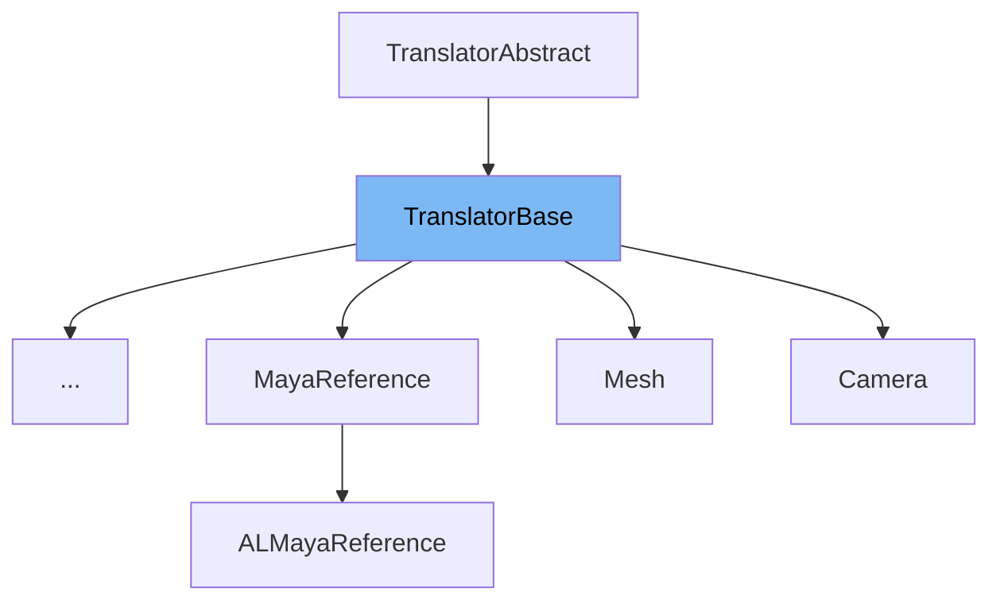

This document will cover the following topics related to the TranslatorBase class in the maya-usd repository:

1. What is TranslatorBase
2. Variables and functions in TranslatorBase
3. Usage example of TranslatorBase in DirectionalLight



# What is TranslatorBase

TranslatorBase is a base class for Maya translator USD plugins in the maya-usd repository. It is used to translate USD prims into Maya nodes and vice versa. The class provides a set of virtual methods that can be overridden by derived classes to customize the translation process. These methods include initialization, import, export, update, and teardown operations. The TranslatorBase class also provides context management for the translation process, allowing translators to add references to prims they have created.

<SwmSnippet path="/plugin/al/lib/AL_USDMaya/AL/usdmaya/fileio/translators/TranslatorBase.h" line="324">

---

# Variables and functions

The `m_translatedType` variable is used to store the schema type of the node that the translator translates.

```c
    TfType               m_translatedType;
```

---

</SwmSnippet>

<SwmSnippet path="/plugin/al/lib/AL_USDMaya/AL/usdmaya/fileio/translators/TranslatorBase.h" line="325">

---

The `m_context` variable is used to store the context currently being used to translate the USD prims.

```c
    TranslatorContextPtr m_context;
```

---

</SwmSnippet>

<SwmSnippet path="/plugin/al/lib/AL_USDMaya/AL/usdmaya/fileio/translators/TranslatorBase.h" line="326">

---

The `m_active` variable is used to store the active status of the translator.

```c
    bool                 m_active = true;
```

---

</SwmSnippet>

<SwmSnippet path="/plugin/al/lib/AL_USDMaya/AL/usdmaya/fileio/translators/TranslatorBase.h" line="328">

---

The `m_registrationType` variable is used to store how the plugin was registered (e.g by schematype or by assettype).

```c
        m_registrationType; /// how was this plugin registered (e.g by schematype or by assettype)
```

---

</SwmSnippet>

<SwmSnippet path="/plugin/al/lib/AL_USDMaya/AL/usdmaya/fileio/translators/TranslatorBase.h" line="244">

---

The `context` function is used to return the context currently being used to translate the USD prims.

```c
    TranslatorContextPtr context() const { return m_context; }
```

---

</SwmSnippet>

<SwmSnippet path="/plugin/al/lib/AL_USDMaya/AL/usdmaya/fileio/translators/TranslatorBase.h" line="263">

---

The `exportCustomAnim` function is used to generate animation that cannot be mapped between an MPlug and a UsdAttribute.

```c
    virtual void exportCustomAnim(const MDagPath& path, UsdPrim& prim, const UsdTimeCode& timeCode)
    {
        (void)path;
        (void)prim;
        (void)timeCode;
    }
```

---

</SwmSnippet>

<SwmSnippet path="/plugin/al/lib/AL_USDMaya/AL/usdmaya/fileio/translators/TranslatorBase.h" line="213">

---

The `canExport` function is used to test a Maya node to see whether it can be exported.

```c
    virtual ExportFlag canExport(const MObject& obj) { return ExportFlag::kNotSupported; }
```

---

</SwmSnippet>

# Usage example

The TranslatorBase class is an abstract base class and is not used directly. Instead, it is subclassed by specific translator classes that implement the translation logic for specific types of prims. An example of a class that inherits from TranslatorBase is the DirectionalLight class. The DirectionalLight class would implement the virtual methods provided by TranslatorBase to provide the logic for translating a DirectionalLight prim to a Maya node and vice versa.

&nbsp;

*This is an auto-generated document by Swimm AI 🌊 and has not yet been verified by a human*

<SwmMeta version="3.0.0" repo-id="Z2l0aHViJTNBJTNBbWF5YS11c2QlM0ElM0FnaWxhZG5hdm90" repo-name="maya-usd" doc-type="class"><sup>Powered by [Swimm](/)</sup></SwmMeta>
