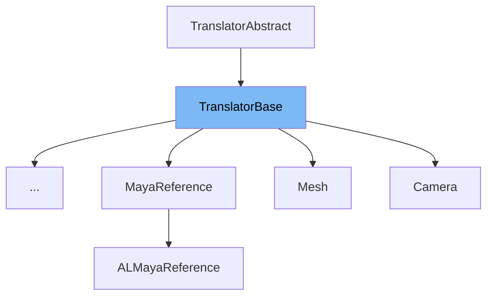

This document will cover the following topics related to the TranslatorBase class:

1. What is TranslatorBase
2. Variables and functions of TranslatorBase
3. Usage example of TranslatorBase



# What is TranslatorBase

TranslatorBase is a base class interface for all translator plugins in the Maya-USD plugin. It provides a set of virtual methods that can be overridden by derived classes to customize the behavior of the translator. The TranslatorBase class is used to facilitate the translation of data between Maya and USD, including the import and export of data, handling of variant switches, and updating of attribute values.

<SwmSnippet path="/plugin/al/lib/AL_USDMaya/AL/usdmaya/fileio/translators/TranslatorBase.h" line="94">

---

# Variables and functions

The TranslatorAbstract class, from which TranslatorBase inherits, defines a set of types used in the TranslatorBase class.

```c
class TranslatorAbstract
    : public TfRefBase
    , public TfWeakBase
{
public:
    typedef TranslatorAbstract This;   ///< this type
    typedef TfRefPtr<This>     RefPtr; ///< the type of a reference this type
    typedef TfWeakPtr<This>    Ptr;    ///< weak pointer to this type
```

---

</SwmSnippet>

<SwmSnippet path="/plugin/al/lib/AL_USDMaya/AL/usdmaya/fileio/translators/TranslatorBase.h" line="109">

---

The `getTranslatedType` and `needsTransformParent` functions are pure virtual functions that must be implemented by any class that inherits from TranslatorBase. `getTranslatedType` returns the schema type of the prim that the translator plugin is responsible for, while `needsTransformParent` indicates whether the custom node type being imported requires a parent transform.

```c
    virtual TfType getTranslatedType() const = 0;

    /// \brief  if the custom node type you are importing requires a parent transform (e.g. you are
    /// importing a shape node),
    ///         then this method should return true. If however you do not need a parent transform
    ///         (e.g. you are importing a texture!), then you can return false here.
    /// \return true if this type of node requires a transform as a parent node (i.e. this is a DAG
    /// node), false if the node
    ///         if a dependency node
    virtual bool needsTransformParent() const { return true; }
```

---

</SwmSnippet>

<SwmSnippet path="/plugin/al/lib/AL_USDMaya/AL/usdmaya/fileio/translators/TranslatorBase.h" line="126">

---

The `initialize` and `import` functions are virtual functions that can be overridden by derived classes. `initialize` is used for one-time initialization of the translator, while `import` is used to create all nodes that the translator will generate.

```c
    virtual MStatus initialize() { return MS::kSuccess; }

    /// \brief  Override this method to import a prim into your scene.
    /// \param  prim the usd prim to be imported into maya
    /// \param  parent a handle to an MObject that represents an AL_usd_Transform node. You should
    /// parent your DAG
    ///         objects under this node. If the prim you are importing is NOT a DAG object (e.g.
    ///         surface shader, etc), then you can ignore this parameter.
    /// \param  createdObj a handle to an MObject created in the importing process
    /// \return MS::kSuccess if all ok
    virtual MStatus import(const UsdPrim& prim, MObject& parent, MObject& createdObj)
    {
        return MS::kSuccess;
    }
```

---

</SwmSnippet>

<SwmSnippet path="/plugin/al/lib/AL_USDMaya/AL/usdmaya/fileio/translators/TranslatorBase.h" line="142">

---

The `exportObject` function is used to export a Maya object into USD. It takes in parameters such as the stage to write the data into, the Maya dag path of the object to export, the path in the USD stage where the prim should be created, and the exporter params.

```c
    /// \param  stage the stage to write the data into
    /// \param  dagPath the Maya dag path of the object to export
    /// \param  usdPath the path in the USD stage where the prim should be created
    /// \param  params the exporter params
    /// \return the prim created
    virtual UsdPrim exportObject(
        UsdStageRefPtr        stage,
        MDagPath              dagPath,
        const SdfPath&        usdPath,
        const ExporterParams& params)
    {
        return UsdPrim();
    }
```

---

</SwmSnippet>

<SwmSnippet path="/plugin/al/lib/AL_USDMaya/AL/usdmaya/fileio/translators/TranslatorBase.h" line="161">

---

The `postImport`, `preTearDown`, `tearDown`, `supportsUpdate`, `update`, `canExport`, `canBeOverridden`, `exportDescendants` functions provide additional control over the import/export process, variant switching, and updating of attribute values.

```c
    virtual MStatus postImport(const UsdPrim& prim) { return MS::kSuccess; }

    /// \brief  If your plugin has its own hashing mechanism, your plugin can override this method
    /// to return
    ///         a *meaningful* value as the unique key for the prim, e.g. a md5 hash or uuid string.
    ///         This method happens just before updating the prim or removing the prim (e.g. when
    ///         switching variant), then USDMaya checks this hash value to decide if update() /
    ///         tearDown() / import() are really necessary to be called. Not implementing this
    ///         method, returning empty string or a false value would indicate this prim is always
    ///         needed to be updated (or tearDown() and import(), depends on the return value of
    ///         supportsUpdate()), this is the backward compatible method (prior 0.35.3); returning
    ///         a constant value would indicate this prim does not need to be updated (or recreated)
    ///         at all.
    /// \param  prim the prim to inspect.
    /// \return unique key string.
    virtual std::size_t generateUniqueKey(const UsdPrim& prim) const { return 0; }

    /// \brief  This method will be called prior to the tear down process taking place. This is the
    /// last chance you have
    ///         to do any serialisation whilst all of the existing nodes are available to query.
    /// \param  prim the prim that may be modified or deleted as a result of a variant switch
```

---

</SwmSnippet>

<SwmSnippet path="/plugin/al/translators/DirectionalLight.h" line="31">

---

# Usage example

The DirectionalLight class is an example of a class that inherits from TranslatorBase. It overrides several of the base class's methods to provide custom behavior for importing and exporting directional lights.

```c
class DirectionalLight : public TranslatorBase
{
public:
    AL_USDMAYA_DECLARE_TRANSLATOR(DirectionalLight);

    MStatus initialize() override;
    MStatus import(const UsdPrim& prim, MObject& parent, MObject& createObj) override;
    UsdPrim exportObject(
        UsdStageRefPtr        stage,
        MDagPath              dagPath,
        const SdfPath&        usdPath,
        const ExporterParams& params) override;
    MStatus preTearDown(UsdPrim& prim) override;
    MStatus tearDown(const SdfPath& path) override;
    MStatus update(const UsdPrim& prim) override;
    MStatus updateMayaAttributes(MObject mayaObj, const UsdPrim& prim);
    bool    updateUsdPrim(const UsdStageRefPtr& stage, const SdfPath& path, const MObject& mayaObj);
    bool    supportsUpdate() const override { return true; }
    ExportFlag canExport(const MObject& obj) override
    {
        return obj.hasFn(MFn::kDirectionalLight) ? ExportFlag::kFallbackSupport
```

---

</SwmSnippet>

&nbsp;

_This is an auto-generated document by Swimm AI 🌊 and has not yet been verified by a human_

<SwmMeta version="3.0.0" repo-id="Z2l0aHViJTNBJTNBbWF5YS11c2QlM0ElM0FnaWxhZG5hdm90" repo-name="maya-usd"><sup>Powered by [Swimm](/)</sup></SwmMeta>
