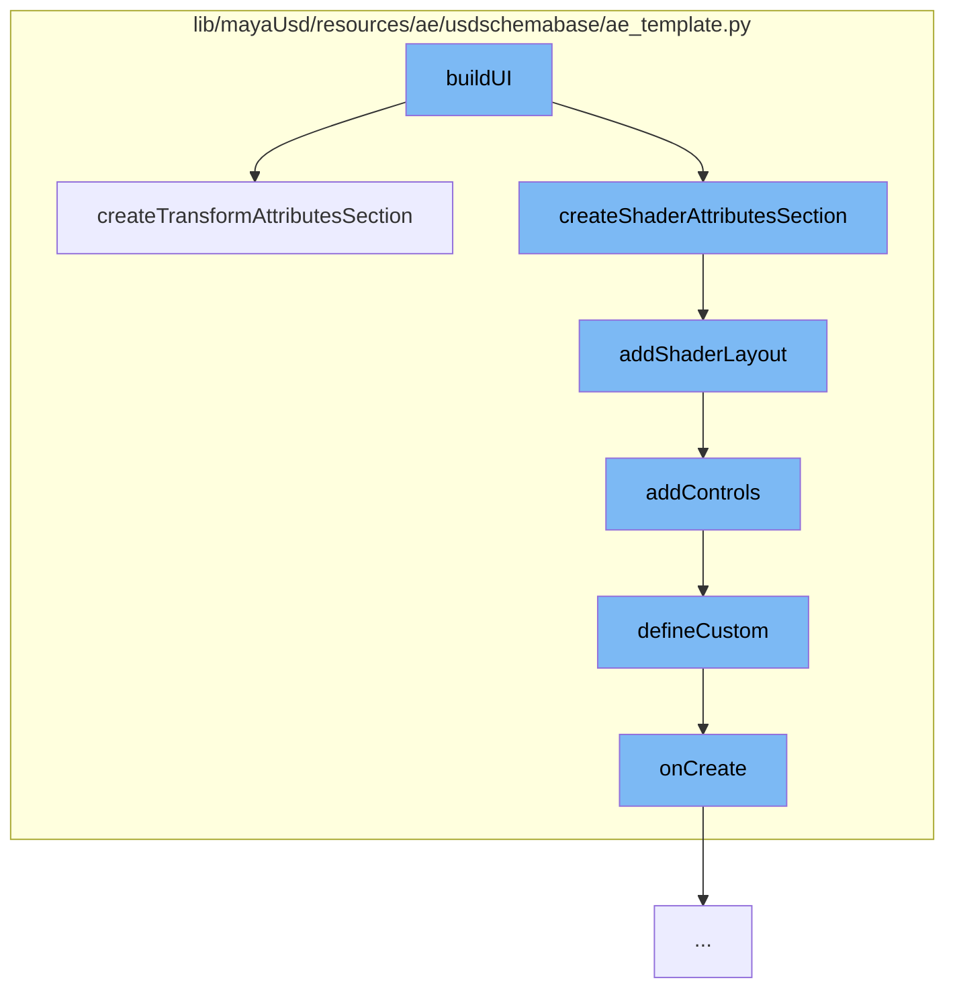

This document will cover the process of building the User Interface (UI) in the Maya USD plugin, which includes:

1. Creating transform attributes section
2. Creating shader attributes section
3. Adding shader layout
4. Adding controls
5. Defining custom controls
6. Creating the UI



<SwmSnippet path="/lib/mayaUsd/resources/ae/usdschemabase/ae_template.py" line="830">

---

# Creating transform attributes section

The function `createTransformAttributesSection` is used to create a section for transform attributes in the UI. It gets the xformOp order and adds those attributes in order, followed by the xformOp order attribute. It also adds a custom control for UFE attribute changes.

```python
    def createTransformAttributesSection(self, sectionName, attrsToAdd):
        # Get the xformOp order and add those attributes (in order)
        # followed by the xformOp order attribute.
        allAttrs = self.attrS.attributeNames
        geomX = UsdGeom.Xformable(self.prim)
        xformOps = geomX.GetOrderedXformOps()
        xformOpOrderNames = [op.GetOpName() for op in xformOps]
        xformOpOrderNames.append(UsdGeom.Tokens.xformOpOrder)

        # Don't use createSection because we want a sub-sections.
        with ufeAeTemplate.Layout(self, sectionName):
            attrsToAdd.remove(UsdGeom.Tokens.xformOpOrder)
            self.addControls(xformOpOrderNames)

            # Get the remainder of the xformOps and add them in an Unused section.
            xformOpUnusedNames = fnmatch.filter(allAttrs, 'xformOp:*')
            xformOpUnusedNames = [ele for ele in xformOpUnusedNames if ele not in xformOpOrderNames]
            self.createSection(getMayaUsdLibString('kLabelUnusedTransformAttrs'), xformOpUnusedNames, collapse=True)

            # Then add any reamining Xformable attributes
            self.addControls(attrsToAdd)
```

---

</SwmSnippet>

<SwmSnippet path="/lib/mayaUsd/resources/ae/usdschemabase/ae_template.py" line="789">

---

# Creating shader attributes section

The function `addShaderLayout` is used to recursively create the full attribute layout section for shader attributes.

```python
    def addShaderLayout(self, group):
        """recursively create the full attribute layout section"""
        with ufeAeTemplate.Layout(self, group.name):
            for item in group.items:
                if isinstance(item, AEShaderLayout.Group):
                    self.addShaderLayout(item)
                else:
                    if self.attrS.attribute(item):
                        self.addControls([item])
```

---

</SwmSnippet>

<SwmSnippet path="/lib/mayaUsd/resources/ae/usdschemabase/ae_template.py" line="715">

---

# Adding controls

The function `addControls` is used to add controls to the UI. It iterates over the controls and for each control, it tries to create a custom control.

```python
    def addControls(self, controls):
        for c in controls:
            if c not in self.suppressedAttrs:
                for controlCreator in AETemplate._controlCreators:
                    try:
                        createdControl = controlCreator(self, c)
                        if createdControl:
                            self.defineCustom(createdControl, c)
                            break
                    except Exception as ex:
                        # Do not let one custom control failure affect others.
                        print('Failed to create control %s: %s' % (c, ex))
                self.addedAttrs.append(c)
```

---

</SwmSnippet>

<SwmSnippet path="/lib/mayaUsd/resources/ae/usdschemabase/ae_template.py" line="734">

---

# Defining custom controls

The function `defineCustom` is used to define custom controls. It uses the `cmds.editorTemplate` function to create and replace custom controls.

```python
    def defineCustom(customObj, attrs=[]):
        create = lambda *args : customObj.onCreate(args)
        replace = lambda *args : customObj.onReplace(args)
        cmds.editorTemplate(attrs, callCustom=[create, replace])
```

---

</SwmSnippet>

<SwmSnippet path="/lib/mayaUsd/resources/ae/usdschemabase/ae_template.py" line="111">

---

# Creating the UI

The function `onCreate` is used to create the UI. It adds an observer to the attributes of the item.

```python
    def onCreate(self, *args):
        ufe.Attributes.addObserver(self._item, self)
```

---

</SwmSnippet>

&nbsp;

_This is an auto-generated document by Swimm AI 🌊 and has not yet been verified by a human_

<SwmMeta version="3.0.0" repo-id="Z2l0aHViJTNBJTNBbWF5YS11c2QlM0ElM0FnaWxhZG5hdm90" repo-name="maya-usd"><sup>Powered by [Swimm](/)</sup></SwmMeta>
