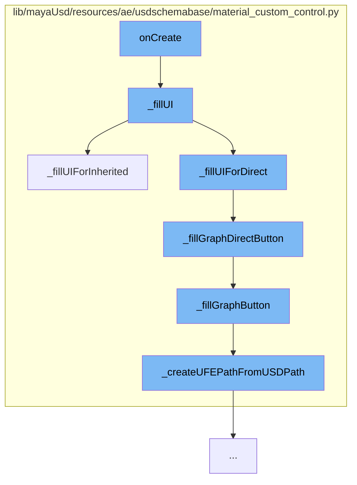

This document will cover the process of creating and filling the User Interface (UI) for materials in the Maya USD plugin. The process includes the following steps:

1. Initializing the UI creation process
2. Filling the UI with material data
3. Handling direct and inherited material bindings
4. Setting up the graph button for the UI



<SwmSnippet path="/lib/mayaUsd/resources/ae/usdschemabase/material_custom_control.py" line="1">

---

# Initializing the UI creation process

The function `onCreate` is the entry point for the UI creation process. It is responsible for initializing the UI and calling the `_fillUI` function to populate the UI with material data.

```python
# Copyright 2024 Autodesk
```

---

</SwmSnippet>

<SwmSnippet path="/lib/mayaUsd/resources/ae/usdschemabase/material_custom_control.py" line="142">

---

# Filling the UI with material data

The `_fillUI` function is responsible for filling the UI with material data. It computes the bound material and checks if there is a direct binding. Depending on the binding type, it calls either `_fillUIForDirect` or `_fillUIForInherited` function.

```python
    def _fillUI(self):
        '''
        Fill the UI with the material data.
        '''
        matAPI = UsdShade.MaterialBindingAPI(self.prim)
        mat, matRel = matAPI.ComputeBoundMaterial()
        directBinding = matAPI.GetDirectBinding()

        token = 'weakerThanDescendants'
        if directBinding:
            directRel = directBinding.GetBindingRel()
            token = UsdShade.MaterialBindingAPI.GetMaterialBindingStrength(directRel)
        strength = self.strengthLabels[token]

        if matRel.GetPrim() == self.prim:
            self._fillUIForDirect(mat, strength)
        else:
            self._fillUIForInherited(mat, matRel, directBinding.GetMaterialPath(), strength)
```

---

</SwmSnippet>

<SwmSnippet path="/lib/mayaUsd/resources/ae/usdschemabase/material_custom_control.py" line="176">

---

# Handling direct and inherited material bindings

The `_fillUIForInherited` function is called when the material is inherited from an ancestor prim. It fills the UI with the appropriate data for inherited materials.

```python
    def _fillUIForInherited(self, mat, matRel, directMatPath, strength):
        '''
        Fill the UI when the material is inherited from an ancestor prim.
        '''
        directPathStr = directMatPath.pathString if directMatPath else ''
        inheritedPathStr = mat.GetPath().pathString
        fromPathStr = matRel.GetPrim().GetPath().pathString

        # Note: fill values before showing UI elements.
        self._fillGraphDirectButton(directPathStr)
        self._fillGraphInheritedButton(inheritedPathStr)
        self._fillGotoPrimButton(fromPathStr)
        self._fillUIValues(directPathStr, inheritedPathStr, fromPathStr, strength)

        cmds.rowLayout(self.inheritedMat.layout, edit=True, visible=True)
        cmds.rowLayout(self.fromPrim.layout, edit=True, visible=True)
```

---

</SwmSnippet>

<SwmSnippet path="/lib/mayaUsd/resources/ae/usdschemabase/material_custom_control.py" line="236">

---

# Setting up the graph button for the UI

The `_fillGraphButton` function is responsible for setting up the graph button with the correct command. It checks if LookdevX is loaded and if a material path exists. If both conditions are met, it creates a UFE path from the USD path and sets up the graph button.

```python
    def _fillGraphButton(self, matPathStr, button, menu):
        '''
        Fill the graph button with the correct command.
        '''
        # Note: only show the graph button if LookdevX was loaded when the UI
        #       was created.
        if not button:
            return

        # Note: only show the graph button if LookdevX is currently loaded.
        hasLookdevX = self._hasLookdevX()
        canGraph = bool(matPathStr and hasLookdevX)
        cmds.symbolButton(button, edit=True, enable=canGraph, visible=hasLookdevX)

        if canGraph:
            ufePathStr = self._createUFEPathFromUSDPath(matPathStr)
            command = partial(MaterialCustomControl._fillGraphMenu, menu=menu, ufePathStr=ufePathStr)
        else:
            command = ''
        cmds.popupMenu(menu, edit=True, postMenuCommand=command)
```

---

</SwmSnippet>

&nbsp;

_This is an auto-generated document by Swimm AI 🌊 and has not yet been verified by a human_

<SwmMeta version="3.0.0" repo-id="Z2l0aHViJTNBJTNBbWF5YS11c2QlM0ElM0FnaWxhZG5hdm90" repo-name="maya-usd"><sup>Powered by [Swimm](/)</sup></SwmMeta>
