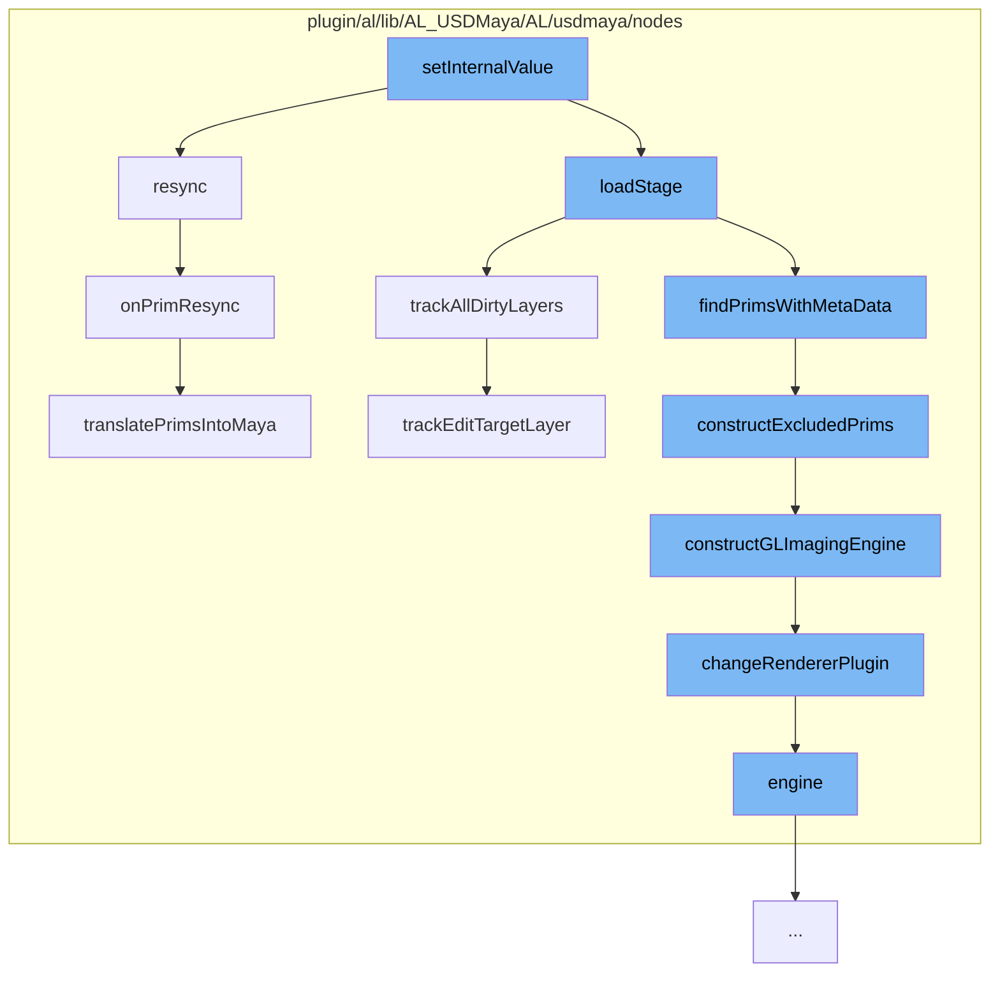

This document will cover the process of updating the USD stage in the Maya scene, which includes:

1. Setting internal values
2. Resyncing the stage
3. Loading the stage
4. Tracking dirty layers
5. Constructing excluded prims
6. Constructing GL imaging engine
7. Changing the renderer plugin
8. Resyncing prims
9. Translating prims into Maya.



<SwmSnippet path="/plugin/al/lib/AL_USDMaya/AL/usdmaya/nodes/ProxyShape.cpp" line="1">

---

# Setting internal values

The process starts with the `setInternalValue` function. This function is not directly shown in the context, but it's the starting point of the flow.

```c++
//
```

---

</SwmSnippet>

<SwmSnippet path="/plugin/al/lib/AL_USDMaya/AL/usdmaya/nodes/ProxyShape.cpp" line="804">

---

# Resyncing the stage

`resync` function is called to update the USD stage in the Maya scene. It prepares a list of prims that will change under the path to resync and then calls `onPrimResync` function.

```c++
//----------------------------------------------------------------------------------------------------------------------
void ProxyShape::resync(const SdfPath& primPath)
{
    // FIMXE: This method was needed to call update() on all translators in the maya scene. Since
    // then some new locking and selectability functionality has been added to onObjectsChanged(). I
    // would want to call the logic in that method to handle this resyncing but it would need to be
    // refactored.

    SdfPathVector existingSchemaPrims;

    // populates list of prims from prim mapping that will change under the path to resync.
    onPrePrimChanged(primPath, existingSchemaPrims);

    onPrimResync(primPath, existingSchemaPrims);
}
```

---

</SwmSnippet>

<SwmSnippet path="/plugin/al/lib/AL_USDMaya/AL/usdmaya/nodes/ProxyShape.cpp" line="749">

---

# Loading the stage

`loadStage` function is called which then calls `trackAllDirtyLayers` function to track all the dirty layers in the stage.

```c++
//----------------------------------------------------------------------------------------------------------------------
void ProxyShape::trackAllDirtyLayers(LayerManager* layerManager)
{
    trackEditTargetLayer(layerManager);
    if (!layerManager)
        layerManager = LayerManager::findOrCreateManager();
    auto usedLayer = m_stage->GetUsedLayers();
    for (auto& _layer : usedLayer) {
        if (_layer->IsDirty())
            layerManager->addLayer(_layer);
    }
}
```

---

</SwmSnippet>

<SwmSnippet path="/plugin/al/lib/AL_USDMaya/AL/usdmaya/nodes/ProxyShape.cpp" line="706">

---

# Tracking dirty layers

`trackAllDirtyLayers` function tracks all the dirty layers in the stage and adds them to the layer manager.

```c++
//----------------------------------------------------------------------------------------------------------------------
void ProxyShape::trackEditTargetLayer(LayerManager* layerManager)
{
    MProfilingScope profilerScope(
        _proxyShapeProfilerCategory, MProfiler::kColorE_L3, "Track edit target layer");

    TF_DEBUG(ALUSDMAYA_LAYERS).Msg("ProxyShape::trackEditTargetLayer\n");
    auto stage = getUsdStage();

    if (!stage) {
        TF_DEBUG(ALUSDMAYA_LAYERS).Msg(" - no stage\n");
        return;
    }

    auto currTargetLayer = stage->GetEditTarget().GetLayer();

    TF_DEBUG(ALUSDMAYA_LAYERS)
        .Msg(" - curr target layer: %s\n", currTargetLayer->GetIdentifier().c_str());

    if (m_prevEditTarget != currTargetLayer) {
        if (!layerManager) {
```

---

</SwmSnippet>

<SwmSnippet path="/plugin/al/lib/AL_USDMaya/AL/usdmaya/nodes/proxy/ProxyShapeMetaData.cpp" line="120">

---

# Constructing excluded prims

`constructExcludedPrims` function is called to construct the excluded prims. If the excluded geometry has changed, it calls `constructGLImagingEngine` function.

```c++
//----------------------------------------------------------------------------------------------------------------------
void ProxyShape::constructExcludedPrims()
{
    MProfilingScope profilerScope(
        _proxyShapeMetadataProfilerCategory, MProfiler::kColorE_L3, "Construct excluded prims");

    auto excludedPaths = getExcludePrimPaths();
    if (m_excludedGeometry != excludedPaths) {
        std::swap(m_excludedGeometry, excludedPaths);
        _IncreaseExcludePrimPathsVersion();
        constructGLImagingEngine();
    }
}
```

---

</SwmSnippet>

<SwmSnippet path="/plugin/al/lib/AL_USDMaya/AL/usdmaya/nodes/ProxyShape.cpp" line="351">

---

# Constructing GL imaging engine

`constructGLImagingEngine` function is called to construct the GL imaging engine. It creates a new engine and sets the renderer plugin based on the RendererManager setting.

```c++
//----------------------------------------------------------------------------------------------------------------------
void ProxyShape::constructGLImagingEngine()
{
    TF_DEBUG(ALUSDMAYA_EVALUATION).Msg("ProxyShape::constructGLImagingEngine\n");

    MProfilingScope profilerScope(
        _proxyShapeProfilerCategory, MProfiler::kColorE_L3, "Construct GL imaging engine");

    // kBatch does not cover mayapy use, we only need this in interactive mode:
    if (MGlobal::mayaState() == MGlobal::kInteractive) {
        if (m_stage) {
            // function prototype of callback we wish to register
            typedef void (*proxy_function_prototype)(void*, AL::usdmaya::nodes::ProxyShape*);

            // delete previous instance
            destroyGLImagingEngine();
            SdfPathVector excludedGeometryPaths = getExcludePrimPaths();

            m_engine = new Engine(m_path, excludedGeometryPaths);
            // set renderer plugin based on RendererManager setting
            RendererManager* manager = RendererManager::findManager();
```

---

</SwmSnippet>

<SwmSnippet path="/plugin/al/lib/AL_USDMaya/AL/usdmaya/nodes/RendererManager.cpp" line="211">

---

# Changing the renderer plugin

`changeRendererPlugin` function is called to change the renderer plugin of the proxy shape.

```c++
//----------------------------------------------------------------------------------------------------------------------
void RendererManager::changeRendererPlugin(ProxyShape* proxy, bool creation)
{
    TF_DEBUG(ALUSDMAYA_RENDERER).Msg("RendererManager::changeRendererPlugin\n");
    assert(proxy);
    if (proxy->engine(false)) {
        int rendererId = getRendererPluginIndex();
        if (rendererId >= 0) {
            // Skip redundant renderer changes on ProxyShape creation
            if (rendererId == 0 && creation)
                return;

            assert(static_cast<size_t>(rendererId) < m_rendererPluginsTokens.size());
            TfToken plugin = m_rendererPluginsTokens[rendererId];
            if (!proxy->engine()->SetRendererPlugin(plugin)) {
                MString data(plugin.data());
                MGlobal::displayError(MString("Failed to set renderer plugin: ") + data);
            }
        } else {
            MPlug   plug(thisMObject(), m_rendererPluginName);
            MString pluginName = plug.asString();
```

---

</SwmSnippet>

<SwmSnippet path="/plugin/al/lib/AL_USDMaya/AL/usdmaya/nodes/ProxyShape.cpp" line="762">

---

# Resyncing prims

`onPrimResync` function is called to resync the prims. It finds the new set of prims and removes prims that have disappeared and translates new prims into Maya.

```c++
//----------------------------------------------------------------------------------------------------------------------
void ProxyShape::onPrimResync(SdfPath primPath, SdfPathVector& previousPrims)
{
    MProfilingScope profilerScope(
        _proxyShapeProfilerCategory, MProfiler::kColorE_L3, "Run onPrimResync");

    TF_DEBUG(ALUSDMAYA_TRANSLATORS)
        .Msg("ProxyShape::onPrimResync checking %s\n", primPath.GetText());

    UsdPrim resyncPrim = m_stage->GetPrimAtPath(primPath);
    if (!resyncPrim.IsValid()) {
        return;
    }

    TF_DEBUG(ALUSDMAYA_TRANSLATORS)
        .Msg("ProxyShape::onPrimResync begin:\n%s\n", context()->serialise().asChar());

    MFnDagNode fn(thisMObject());
    MDagPath   proxyTransformPath;
    fn.getPath(proxyTransformPath);
    proxyTransformPath.pop();
```

---

</SwmSnippet>

<SwmSnippet path="/plugin/al/lib/AL_USDMaya/AL/usdmaya/nodes/ProxyShape.cpp" line="225">

---

# Translating prims into Maya

`translatePrimsIntoMaya` function is called to translate prims into Maya. It removes entries from the context, creates transform chains for schema prims, creates schema prims, updates schema prims, and connects schema prims.

```c++
//----------------------------------------------------------------------------------------------------------------------
void ProxyShape::translatePrimsIntoMaya(
    const UsdPrimVector&                             importPrims,
    const SdfPathVector&                             teardownPrims,
    const fileio::translators::TranslatorParameters& param,
    const SdfPathSet&                                affectedPaths)
{
    MProfilingScope profilerScope(
        _proxyShapeProfilerCategory, MProfiler::kColorE_L3, "Translate prims into Maya");

    TF_DEBUG(ALUSDMAYA_EVALUATION)
        .Msg(
            "ProxyShape:translatePrimsIntoMaya ImportSize='%zd' TearDownSize='%zd' \n",
            importPrims.size(),
            teardownPrims.size());

    proxy::PrimFilter filter(teardownPrims, importPrims, this, param.forceTranslatorImport());

    if (TfDebug::IsEnabled(ALUSDMAYA_TRANSLATORS)) {
        std::cout << "new prims" << std::endl;
        for (auto it : filter.newPrimSet()) {
```

---

</SwmSnippet>

&nbsp;

_This is an auto-generated document by Swimm AI 🌊 and has not yet been verified by a human_

<SwmMeta version="3.0.0" repo-id="Z2l0aHViJTNBJTNBbWF5YS11c2QlM0ElM0FnaWxhZG5hdm90" repo-name="maya-usd"><sup>Powered by [Swimm](/)</sup></SwmMeta>
