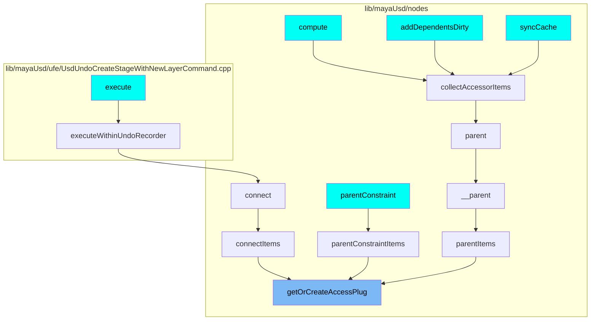
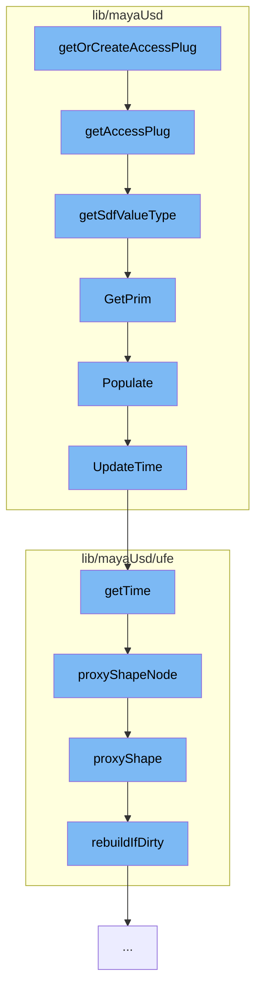

This document will cover the process of accessing and manipulating USD attributes in the Maya scene, which includes:

1. Getting or creating an access plug for a USD attribute
2. Retrieving the type of a USD attribute
3. Accessing the USD primitive associated with a Maya node
4. Populating the scene index with USD primitives
5. Updating the time code for the scene index
6. Retrieving the time code from a proxy shape node
7. Accessing the proxy shape node associated with a USD stage
8. Rebuilding the stage map if necessary.

## Where is this flow used?

The flow starts with the function `getOrCreateAccessPlug`. It is called from multiple entry points as represented in the following diagram: (Note - these are only some of the entry points of this flow)



## The flow itself



<SwmSnippet path="/lib/mayaUsd/nodes/proxyAccessor.py" line="174">

---

# Getting or creating an access plug for a USD attribute

The function `getOrCreateAccessPlug` is used to get or create an access plug for a USD attribute. If the attribute does not exist, it returns None.

```python
def getAccessPlug(ufeObject, usdAttrName, sdfValueType=Sdf.ValueTypeNames.Matrix4d):
    selectedDagPath, selectedPrimPath = getDagAndPrimFromUfe(ufeObject)

    if selectedDagPath == None or selectedPrimPath == None:
        return None

    sdfPath = Sdf.Path(selectedPrimPath)

    if not usdAttrName == "":
        sdfPath = getPrimAttrPath(sdfPath, selectedPrimPath, usdAttrName)
        sdfValueType = getSdfValueType(ufeObject,usdAttrName)

    plugNameValueAttr = getAccessPlugName(sdfPath)

    exists = cmds.attributeQuery(plugNameValueAttr, node=selectedDagPath, exists=True)
    if not exists:
        return None

    return plugNameValueAttr
```

---

</SwmSnippet>

<SwmSnippet path="/lib/mayaUsd/nodes/proxyAccessor.py" line="146">

---

# Retrieving the type of a USD attribute

The function `getSdfValueType` is used to retrieve the type of a USD attribute. If the attribute is not defined, it returns None.

```python
def getSdfValueType(ufeObject, usdAttrName):
    # 'combinedVisibility' is not a usd prim property, so we define its type manually
    if usdAttrName == 'combinedVisibility':
        return Sdf.ValueTypeNames.Int

    proxyDagPath, usdPrimPath = getDagAndPrimFromUfe(ufeObject)

    stage = mayaUsdLib.GetPrim(proxyDagPath).GetStage()

    primPath = Sdf.Path(usdPrimPath)
    prim = stage.GetPrimAtPath(primPath)

    usdAttribute = prim.GetAttribute(usdAttrName)
    if usdAttribute.IsDefined():
        return usdAttribute.GetTypeName()
    else:
        return None
```

---

</SwmSnippet>

<SwmSnippet path="/lib/mayaUsd/sceneIndex/proxyShapeSceneIndexPlugin.cpp" line="381">

---

# Accessing the USD primitive associated with a Maya node

The method `GetPrim` is used to access the USD primitive associated with a Maya node. If the primitive is not found, it populates the scene index.

```c++
// satisfying HdSceneIndexBase
HdSceneIndexPrim MayaUsdProxyShapeSceneIndex::GetPrim(const SdfPath& primPath) const
{
    // MAYA-126790 TODO: properly resolve missing PrimsAdded notification issue
    // https://github.com/PixarAnimationStudios/USD/blob/dev/pxr/imaging/hd/sceneIndex.cpp#L38
    // Pixar has discussed adding a missing overridable virtual function when an observer is
    // registered For now GetPrim called with magic string populates the scene index
    static SdfPath maya126790Workaround("maya126790Workaround");
    if (primPath == maya126790Workaround) {
        auto nonConstThis = const_cast<MayaUsdProxyShapeSceneIndex*>(this);
        nonConstThis->Populate();
        return HdSceneIndexPrim();
    }

    return _GetInputSceneIndex()->GetPrim(primPath);
}
```

---

</SwmSnippet>

<SwmSnippet path="/lib/mayaUsd/sceneIndex/proxyShapeSceneIndexPlugin.cpp" line="356">

---

# Populating the scene index with USD primitives

The method `Populate` is used to populate the scene index with USD primitives. It also updates the time code for the scene index.

```c++
void MayaUsdProxyShapeSceneIndex::Populate()
{
    if (!_populated) {
        auto stage = _proxyShape->getUsdStage();
        if (TF_VERIFY(stage, "Unable to fetch a valid USDStage.")) {
            _usdImagingStageSceneIndex->SetStage(stage);
            // Check whether the pseudo-root has children
            if (!stage->GetPseudoRoot().GetChildren().empty())
            // MAYA-126641: Upon first call to MayaUsdProxyShapeBase::getUsdStage, the stage may be
            // empty. Do not mark the scene index as _populated, until stage is full. This is taken
            // care of inside MayaUsdProxyShapeSceneIndex::_StageSet callback.
            {
#if PXR_VERSION < 2305
                // In most recent USD, Populate is called from within SetStage, so there is no need
                // to callsites to call it explicitly
                _usdImagingStageSceneIndex->Populate();
#endif
                _populated = true;
            }
            // Set the initial time
            UpdateTime();
```

---

</SwmSnippet>

<SwmSnippet path="/lib/mayaUsd/sceneIndex/proxyShapeSceneIndexPlugin.cpp" line="325">

---

# Updating the time code for the scene index

The method `UpdateTime` is used to update the time code for the scene index.

```c++
void MayaUsdProxyShapeSceneIndex::UpdateTime()
{
    if (_usdImagingStageSceneIndex && _proxyShape && isProxyShapeValid()) {
        _usdImagingStageSceneIndex->SetTime(_proxyShape->getTime());
    }
}
```

---

</SwmSnippet>

<SwmSnippet path="/lib/mayaUsd/ufe/Utils.cpp" line="282">

---

# Retrieving the time code from a proxy shape node

The function `getTime` is used to retrieve the time code from a proxy shape node.

```c++
UsdTimeCode getTime(const Ufe::Path& path)
{
    // Path should not be empty.
    if (!TF_VERIFY(!path.empty())) {
        return UsdTimeCode::Default();
    }

    // Proxy shape node should not be null.
    auto proxyShape = UsdStageMap::getInstance().proxyShapeNode(path);
    if (!TF_VERIFY(proxyShape)) {
        return UsdTimeCode::Default();
    }

    return proxyShape->getTime();
}
```

---

</SwmSnippet>

<SwmSnippet path="/lib/mayaUsd/ufe/UsdStageMap.cpp" line="235">

---

# Accessing the proxy shape node associated with a USD stage

The method `proxyShapeNode` is used to access the proxy shape node associated with a USD stage.

```c++
MayaUsdProxyShapeBase* UsdStageMap::proxyShapeNode(const Ufe::Path& path, bool rebuildCacheIfNeeded)
{
    auto obj = proxyShape(path, rebuildCacheIfNeeded);
    if (obj.isNull()) {
        return nullptr;
    }

    return objToProxyShape(obj);
}
```

---

</SwmSnippet>

<SwmSnippet path="/lib/mayaUsd/ufe/UsdStageMap.cpp" line="286">

---

# Rebuilding the stage map if necessary

The method `rebuildIfDirty` is used to rebuild the stage map if it is marked as dirty.

```c++
bool UsdStageMap::rebuildIfDirty()
{
    if (!_dirty)
        return false;

    for (const auto& psn : ProxyShapeHandler::getAllNames()) {
        addItem(toPath(psn));
    }

    TF_DEBUG(MAYAUSD_STAGEMAP)
        .Msg("Rebuilt stage map, found %d proxy shapes\n", int(_stageToObject.size()));
    _dirty = false;
    return true;
}
```

---

</SwmSnippet>

&nbsp;

_This is an auto-generated document by Swimm AI 🌊 and has not yet been verified by a human_

<SwmMeta version="3.0.0" repo-id="Z2l0aHViJTNBJTNBbWF5YS11c2QlM0ElM0FnaWxhZG5hdm90" repo-name="maya-usd"><sup>Powered by [Swimm](/)</sup></SwmMeta>
