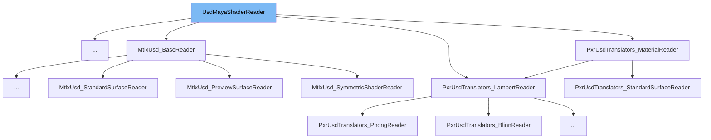

This document will cover the following aspects of the UsdMayaShaderReader class:

1. What is UsdMayaShaderReader
2. Variables and functions of UsdMayaShaderReader
3. Usage example of UsdMayaShaderReader



# What is UsdMayaShaderReader

The UsdMayaShaderReader class is a base class for USD prim readers that import USD shader prims as Maya shading nodes. It is part of the Maya USD plugin and is used to facilitate the translation of shading and rendering information between the USD and Maya frameworks.

<SwmSnippet path="/lib/mayaUsd/fileio/shaderReader.h" line="44">

---

# Variables and functions

The constructor `UsdMayaShaderReader` is used to create an instance of the class. It takes a `UsdMayaPrimReaderArgs` object as an argument.

```c
    UsdMayaShaderReader(const UsdMayaPrimReaderArgs&);
```

---

</SwmSnippet>

<SwmSnippet path="/lib/mayaUsd/fileio/shaderReader.h" line="49">

---

The static function `CanImport` is used to determine how well this class can support the current context. It takes a `UsdMayaJobImportArgs` object as an argument.

```c
    static ContextSupport CanImport(const UsdMayaJobImportArgs& importArgs);
```

---

</SwmSnippet>

<SwmSnippet path="/lib/mayaUsd/fileio/shaderReader.h" line="63">

---

The function `GetMayaPlugForUsdAttrName` is used to get the Maya shading plug that corresponds to the USD attribute named `usdAttrName` on `mayaObject`.

```c
    virtual MPlug
    GetMayaPlugForUsdAttrName(const TfToken& usdAttrName, const MObject& mayaObject) const;
```

---

</SwmSnippet>

<SwmSnippet path="/lib/mayaUsd/fileio/shaderReader.h" line="75">

---

The function `GetMayaNameForUsdAttrName` is used to get the name of the Maya shading attribute that corresponds to the USD attribute named `usdAttrName`.

```c
    virtual TfToken GetMayaNameForUsdAttrName(const TfToken& usdAttrName) const;
```

---

</SwmSnippet>

<SwmSnippet path="/lib/mayaUsd/fileio/shaderReader.h" line="86">

---

The function `TraverseUnconnectableInput` is used to continue traversing on the given `shaderInput` even though it is not representable as a connectable Maya MPlug.

```c
    virtual bool TraverseUnconnectableInput(const TfToken& usdAttrName);
```

---

</SwmSnippet>

<SwmSnippet path="/lib/mayaUsd/fileio/shaderReader.h" line="90">

---

The function `PostConnectSubtree` is a callback after the shading context reader is done connecting all inputs. It takes a `UsdMayaPrimReaderContext` object as an argument.

```c
    virtual void PostConnectSubtree(UsdMayaPrimReaderContext* context);
```

---

</SwmSnippet>

<SwmSnippet path="/lib/mayaUsd/fileio/shaderReader.h" line="108">

---

The function `IsConverter` is used to check if this is a converter importer.

```c
    virtual boost::optional<IsConverterResult> IsConverter();
```

---

</SwmSnippet>

<SwmSnippet path="/lib/mayaUsd/fileio/shaderReader.h" line="114">

---

The function `SetDownstreamReader` is used to set a downstream converter to use for caching calls to `GetCreatedObject` and `GetMayaPlugForUsdAttrName`. It takes a `UsdMayaShaderReader` object as an argument.

```c
    virtual void SetDownstreamReader(std::shared_ptr<UsdMayaShaderReader> downstreamReader);
```

---

</SwmSnippet>

<SwmSnippet path="/lib/mayaUsd/fileio/shaderReader.h" line="123">

---

The function `GetCreatedObject` is used to get the Maya object that was created by this reader. It takes a `UsdMayaShadingModeImportContext` object and a `UsdPrim` object as arguments.

```c
    virtual MObject
    GetCreatedObject(const UsdMayaShadingModeImportContext&, const UsdPrim& prim) const;
```

---

</SwmSnippet>

# Usage example

The UsdMayaShaderReader class is a base class and is not used directly. Instead, it is extended by other classes to implement specific functionality. An example of this is the PxrMayaUsdUVTexture_Reader class, which extends UsdMayaShaderReader to provide specific functionality for reading UV texture data.

&nbsp;

*This is an auto-generated document by Swimm AI 🌊 and has not yet been verified by a human*

<SwmMeta version="3.0.0" repo-id="Z2l0aHViJTNBJTNBbWF5YS11c2QlM0ElM0FnaWxhZG5hdm90" repo-name="maya-usd" doc-type="class"><sup>Powered by [Swimm](/)</sup></SwmMeta>
