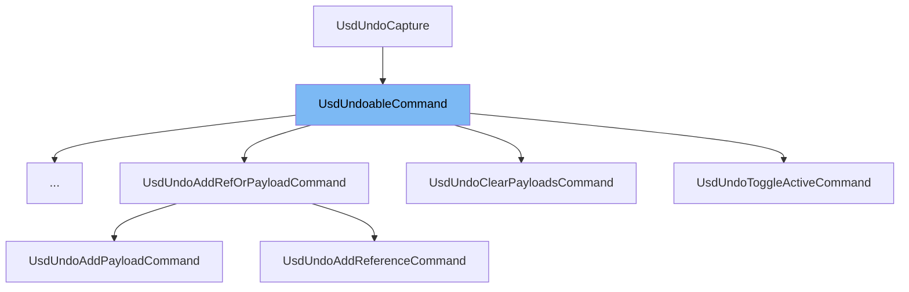

This document will cover the following topics related to the `UsdUndoableCommand` class:

1. What is `UsdUndoableCommand`.
2. Variables and functions of `UsdUndoableCommand`.
3. An example of how to use `UsdUndoableCommand`.



# What is UsdUndoableCommand

`UsdUndoableCommand` is a templated helper class designed to factor out common code for USD undoable commands. It is a part of the USDUFE namespace and is used to handle the capture of USD data changes and undo and redo them. It is not meant to be used directly, but via the template class below. It avoids having every instantiation of the template have a copy of the same code and simplifies debugging by having a central point for all USD commands.

<SwmSnippet path="/lib/usdUfe/ufe/UsdUndoableCommand.h" line="91">

---

# Variables and functions

`UsdUndoableCommand` is a class that inherits from `UsdUndoCapture` and `Cmd`. It has a constructor that allows passing arguments to the command base class. It also overrides the `execute()`, `undo()`, and `redo()` functions from the `Ufe::UndoableCommand` class.

```c
class UsdUndoableCommand
    : public UsdUndoCapture
    , public Cmd
{
public:
    // This constructor allows passing arguments to the command bae class.
    // The magic of templated function will elide this if not used.
    template <class... ARGS>
    UsdUndoableCommand(const ARGS&... values)
        : Cmd(values...)
    {
    }

    // Ufe::UndoableCommand overrides.
    // Implemented by the UsdUndoCapture base class.

    void execute() override { executeWithUndoCapture(); }
    void undo() override { undoUsdChanges(); }
    void redo() override { redoUsdChanges(); }
};
```

---

</SwmSnippet>

<SwmSnippet path="/lib/usdUfe/ufe/UsdUndoableCommand.h" line="99">

---

The constructor of `UsdUndoableCommand` allows passing arguments to the command base class.

```c
    UsdUndoableCommand(const ARGS&... values)
        : Cmd(values...)
    {
```

---

</SwmSnippet>

<SwmSnippet path="/lib/usdUfe/ufe/UsdUndoableCommand.h" line="107">

---

`execute()`, `undo()`, and `redo()` are functions that are overridden from the `Ufe::UndoableCommand` class. They are implemented by the `UsdUndoCapture` base class.

```c
    void execute() override { executeWithUndoCapture(); }
    void undo() override { undoUsdChanges(); }
    void redo() override { redoUsdChanges(); }
```

---

</SwmSnippet>

<SwmSnippet path="/lib/usdUfe/ufe/UsdUndoableCommand.h" line="117">

---

# Usage example

`UsdFunctionUndoableCommand` is an example of how to use `UsdUndoableCommand`. It is a templated helper class for USD implementations of UFE commands where the implementation is in a function. This avoids having to write a whole class just to implement the single `executeImplementation()` virtual function.

```c
template <typename Cmd> class UsdFunctionUndoableCommand : public UsdUndoableCommand<Cmd>
{
public:
    // The function signature that implements the command.
    using Function = std::function<void()>;

    // This constructor allows passing arguments to the command bae class.
    // The magic of templated function will elide this if not used.
    template <class... ARGS>
    UsdFunctionUndoableCommand(const ARGS&... values, Function&& func)
        : UsdUndoableCommand<Cmd>(values...)
        , _func(func)
    {
    }

    // Implementation of UsdUndoCapture API.

    void executeImplementation() override { _func(); }

private:
    Function _func;
```

---

</SwmSnippet>

&nbsp;

_This is an auto-generated document by Swimm AI 🌊 and has not yet been verified by a human_

<SwmMeta version="3.0.0" repo-id="Z2l0aHViJTNBJTNBbWF5YS11c2QlM0ElM0FnaWxhZG5hdm90" repo-name="maya-usd"><sup>Powered by [Swimm](/)</sup></SwmMeta>
