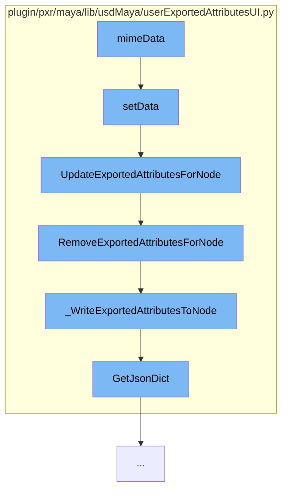

This document will cover the process of updating user exported attributes in the Maya USD plugin. The process includes the following steps:

1. Setting data for exported attributes.
2. Updating exported attributes for a node.
3. Removing exported attributes for a node.
4. Writing exported attributes to a node.
5. Getting a JSON dictionary representation of the exported attributes.



<SwmSnippet path="/plugin/pxr/maya/lib/usdMaya/userExportedAttributesUI.py" line="491">

---

# Setting Data for Exported Attributes

The `setData` function is used to set data for exported attributes. It takes an index and a value, and updates the corresponding attribute based on the column. If the selected nodes exist, it updates the exported attributes for each selected node.

```python
    def setData(self, index, value, role=QtCore.Qt.EditRole):
        if not self._exportedAttrs:
            return False

        row = index.row()
        column = index.column()

        exportedAttr = self._exportedAttrs[row]

        if column == ExportedAttributesModel.USD_ATTR_TYPE_COLUMN:
            exportedAttr.usdAttrType = value
        elif column == ExportedAttributesModel.USD_ATTR_NAME_COLUMN:
            exportedAttr.usdAttrName = value
        elif column == ExportedAttributesModel.PRIMVAR_INTERPOLATION_COLUMN:
            exportedAttr.primvarInterpolation = value
        elif column == ExportedAttributesModel.DOUBLE_PRECISION_COLUMN:
            exportedAttr.translateMayaDoubleToUsdSinglePrecision = value
        else:
            return False

        # Update the selected nodes with the new data.
```

---

</SwmSnippet>

<SwmSnippet path="/plugin/pxr/maya/lib/usdMaya/userExportedAttributesUI.py" line="353">

---

# Updating Exported Attributes for a Node

The `UpdateExportedAttributesForNode` function is used to add or update the attributes for export using the list of ExportedAttribute objects. It first removes any existing attributes with the same mayaAttrName, then adds the updated/added attributes.

```python
    def UpdateExportedAttributesForNode(nodeName, exportedAttrs):
        """
        Given a Maya node name, this method adds or updates the attributes for
        export using the list of ExportedAttribute objects in exportedAttrs.
        Other existing attributes tagged for export are preserved.
        """
        # Exported attributes in exportedAttrs will replace any that already
        # exist with the same mayaAttrName, so remove those from the node first.
        updatedMayaAttrNames = {x.mayaAttrName for x in exportedAttrs}
        currExportedAttrs = ExportedAttribute.RemoveExportedAttributesForNode(
            nodeName, updatedMayaAttrNames)

        # Add the updated/added attributes. Order doesn't matter since we'll
        # be writing it out as a dictionary.
        currExportedAttrs.extend(exportedAttrs)
        ExportedAttribute._WriteExportedAttributesToNode(nodeName, currExportedAttrs)
```

---

</SwmSnippet>

<SwmSnippet path="/plugin/pxr/maya/lib/usdMaya/userExportedAttributesUI.py" line="337">

---

# Removing Exported Attributes for a Node

The `RemoveExportedAttributesForNode` function is used to remove the attributes in mayaAttrNames as attributes that should be exported. It returns the list of remaining exported attributes after the removal.

```python
    def RemoveExportedAttributesForNode(nodeName, mayaAttrNames):
        """
        Given a Maya node name, this method removes the attributes in
        mayaAttrNames as attributes that should be exported. The list of
        remaining exported attributes after the removal is returned.
        """
        exportedAttrs = ExportedAttribute.GetExportedAttributesFromNode(nodeName)

        # Filter out the attrs whose names are in mayaAttrNames.
        exportedAttrs = [x for x in exportedAttrs if x.mayaAttrName not in mayaAttrNames]

        ExportedAttribute._WriteExportedAttributesToNode(nodeName, exportedAttrs)

        return exportedAttrs
```

---

</SwmSnippet>

<SwmSnippet path="/plugin/pxr/maya/lib/usdMaya/userExportedAttributesUI.py" line="371">

---

# Writing Exported Attributes to a Node

The `_WriteExportedAttributesToNode` function is used to record the given list of ExportedAttribute objects in exportedAttrs in the Maya attribute. The passed in list replaces any previous data.

```python
    def _WriteExportedAttributesToNode(nodeName, exportedAttrs):
        """
        Given a Maya node name, this method records the given list of
        ExportedAttribute objects in exportedAttrs in the Maya attribute. the
        passed in list replaces any previous data.

        NOTE: This method will likely only ever be called by the Remove and
        Update methods above since multiple nodes may be selected and only the
        common attributes between them will be displayed.
        """
        jsonDict = {}
        for exportedAttr in exportedAttrs:
            jsonDict.update(exportedAttr.GetJsonDict())

        exportAttrExists = cmds.attributeQuery(EXPORTED_ATTRS_MAYA_ATTR_NAME,
            node=nodeName, exists=True)

        if not jsonDict:
            if exportAttrExists:
                # The export attribute exists but we'd be emptying it, so just
                # remove the attribute instead.
```

---

</SwmSnippet>

<SwmSnippet path="/plugin/pxr/maya/lib/usdMaya/userExportedAttributesUI.py" line="285">

---

# Getting a JSON Dictionary Representation of the Exported Attributes

The `GetJsonDict` function is used to get a dictionary representation of the object that can be dumped to JSON. It includes the mayaAttrName, usdAttrType, usdAttrName, interpolation, and translateMayaDoubleToUsdSinglePrecision if it is enabled.

```python
    def GetJsonDict(self):
        """
        This method returns a dictionary representation of this object
        that can be dumped to JSON.
        """
        result = { self._mayaAttrName : {} }
        if self._usdAttrType:
            result[self._mayaAttrName]['usdAttrType'] = self._usdAttrType
        if self._usdAttrName:
            result[self._mayaAttrName]['usdAttrName'] = self._usdAttrName
        if self._primvarInterpolation:
            result[self._mayaAttrName]['interpolation'] = self._primvarInterpolation

        # Only include translateMayaDoubleToUsdSinglePrecision if it is enabled.
        if self._translateMayaDoubleToUsdSinglePrecision:
            result[self._mayaAttrName]['translateMayaDoubleToUsdSinglePrecision'] = (
                self._translateMayaDoubleToUsdSinglePrecision)

        return result
```

---

</SwmSnippet>

&nbsp;

_This is an auto-generated document by Swimm AI 🌊 and has not yet been verified by a human_

<SwmMeta version="3.0.0" repo-id="Z2l0aHViJTNBJTNBbWF5YS11c2QlM0ElM0FnaWxhZG5hdm90" repo-name="maya-usd"><sup>Powered by [Swimm](/)</sup></SwmMeta>
