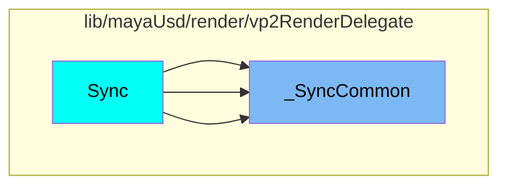
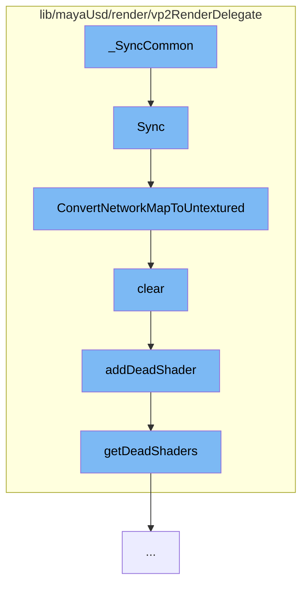

This document will cover the process of synchronizing the VP2 state with the scene delegate state in the Maya USD plugin. The process includes the following steps:

1. Synchronization of the VP2 state
2. Conversion of the network map to untextured
3. Clearing the shader
4. Adding the shader to the dead shaders list
5. Retrieving the dead shaders.

## Where is this flow used?

The flow starts with the function `_SyncCommon`. It is called from multiple entry points as represented in the following diagram:



## The flow itself



<SwmSnippet path="/lib/mayaUsd/render/vp2RenderDelegate/material.cpp" line="2082">

---

# Synchronization of the VP2 state

The function `HdVP2Material::Sync` is used to synchronize the VP2 state with the scene delegate state based on dirty bits. It checks if the dirty bits are set for the material resource or parameters. If they are, it retrieves the material resource and checks if it holds a `HdMaterialNetworkMap`. If it does, it syncs the untextured network and, if required by the display style, the full network.

```c++
/*! \brief  Synchronize VP2 state with scene delegate state based on dirty bits
 */
void HdVP2Material::Sync(
    HdSceneDelegate* sceneDelegate,
    HdRenderParam* /*renderParam*/,
    HdDirtyBits* dirtyBits)
{
    if (*dirtyBits & (HdMaterial::DirtyResource | HdMaterial::DirtyParams)) {
        const SdfPath& id = GetId();

        MProfilingScope profilingScope(
            HdVP2RenderDelegate::sProfilerCategory,
            MProfiler::kColorC_L2,
            "HdVP2Material::Sync",
            id.GetText());

        VtValue vtMatResource = sceneDelegate->GetMaterialResource(id);

        if (vtMatResource.IsHolding<HdMaterialNetworkMap>()) {
            const HdMaterialNetworkMap& fullNetworkMap
                = vtMatResource.UncheckedGet<HdMaterialNetworkMap>();
```

---

</SwmSnippet>

<SwmSnippet path="/lib/mayaUsd/render/vp2RenderDelegate/material.cpp" line="2057">

---

# Conversion of the network map to untextured

The function `ConvertNetworkMapToUntextured` is used to convert the network map to untextured. It iterates over the network map and removes any input nodes. It also clears any relationships and replaces any raw MaterialX surface constructor nodes with default standard_surface nodes.

```c++
void ConvertNetworkMapToUntextured(HdMaterialNetworkMap& networkMap)
{
    for (auto& item : networkMap.map) {
        auto& network = item.second;
        auto  isInputNode = [&networkMap](const HdMaterialNode& node) {
            return std::find(networkMap.terminals.begin(), networkMap.terminals.end(), node.path)
                == networkMap.terminals.end();
        };

        auto eraseBegin = std::remove_if(network.nodes.begin(), network.nodes.end(), isInputNode);
        network.nodes.erase(eraseBegin, network.nodes.end());
        network.relationships.clear();
#ifdef WANT_MATERIALX_BUILD
        // Raw MaterialX surface constructor node does not render. Replace with default
        // standard_surface:
        for (auto& node : network.nodes) {
            if (node.identifier == _mtlxTokens->ND_surface) {
                node.identifier = _mtlxTokens->ND_standard_surface_surfaceshader;
                node.parameters.clear();
            }
        }
```

---

</SwmSnippet>

<SwmSnippet path="/lib/mayaUsd/render/vp2RenderDelegate/shader.cpp" line="148">

---

# Clearing the shader

The method `HdVP2ShaderUniquePtr::clear` is used to clear the shader. It checks if the shader data exists and if it is the last reference to the shader. If it is, it adds the shader to the dead shaders list and deletes the shader data.

```c++
void HdVP2ShaderUniquePtr::clear()
{
    if (!_data)
        return;

    const int prevCount = _data->_count.fetch_sub(1);
    if (prevCount != 1)
        return;

    MHWRender::MShaderInstance* shader = _data->_shader;
    addDeadShader(shader);

    _data->_shader = nullptr;
    delete _data;
    _data = nullptr;
}
```

---

</SwmSnippet>

<SwmSnippet path="/lib/mayaUsd/render/vp2RenderDelegate/shader.cpp" line="36">

---

# Adding the shader to the dead shaders list

The function `addDeadShader` is used to add the shader to the dead shaders list. It checks if the shader exists and, if it does, it adds it to the dead shaders list.

```c++
void addDeadShader(MHWRender::MShaderInstance* shader)
{
    if (!shader)
        return;

    std::lock_guard<std::mutex> mutexGuard(deadShaderMutex);
    getDeadShaders().insert(shader);
}
```

---

</SwmSnippet>

<SwmSnippet path="/lib/mayaUsd/render/vp2RenderDelegate/shader.cpp" line="30">

---

# Retrieving the dead shaders

The method `getDeadShaders` is used to retrieve the dead shaders. It returns a static instance of the dead shaders.

```c++
DeadShaders& getDeadShaders()
{
    static DeadShaders dead;
    return dead;
}
```

---

</SwmSnippet>

&nbsp;

*This is an auto-generated document by Swimm AI 🌊 and has not yet been verified by a human*

<SwmMeta version="3.0.0" repo-id="Z2l0aHViJTNBJTNBbWF5YS11c2QlM0ElM0FnaWxhZG5hdm90" repo-name="maya-usd" doc-type="flows"><sup>Powered by [Swimm](/)</sup></SwmMeta>
