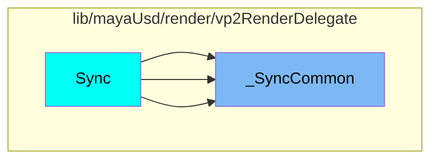
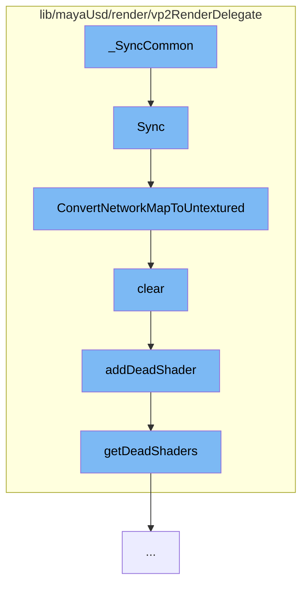

This document will cover the process of synchronizing VP2 state with scene delegate state in the Maya USD plugin. The process includes the following steps:

1. Synchronizing the state
2. Converting the network map to untextured
3. Clearing the shader
4. Adding the shader to the list of dead shaders
5. Retrieving the list of dead shaders.

## Where is this flow used?

The flow starts with the function `_SyncCommon`. It is called from multiple entry points as represented in the following diagram:



## The flow itself



<SwmSnippet path="/lib/mayaUsd/render/vp2RenderDelegate/material.cpp" line="2082">

---

# Synchronizing the state

The `Sync` function is used to synchronize the VP2 state with the scene delegate state based on dirty bits. If the dirty bits indicate that the material resource or parameters have changed, the function retrieves the material resource and checks if it holds a `HdMaterialNetworkMap`. If it does, it synchronizes the untextured network and, if required by the display style, the full network.

```c++
/*! \brief  Synchronize VP2 state with scene delegate state based on dirty bits
 */
void HdVP2Material::Sync(
    HdSceneDelegate* sceneDelegate,
    HdRenderParam* /*renderParam*/,
    HdDirtyBits* dirtyBits)
{
    if (*dirtyBits & (HdMaterial::DirtyResource | HdMaterial::DirtyParams)) {
        const SdfPath& id = GetId();

        MProfilingScope profilingScope(
            HdVP2RenderDelegate::sProfilerCategory,
            MProfiler::kColorC_L2,
            "HdVP2Material::Sync",
            id.GetText());

        VtValue vtMatResource = sceneDelegate->GetMaterialResource(id);

        if (vtMatResource.IsHolding<HdMaterialNetworkMap>()) {
            const HdMaterialNetworkMap& fullNetworkMap
                = vtMatResource.UncheckedGet<HdMaterialNetworkMap>();
```

---

</SwmSnippet>

<SwmSnippet path="/lib/mayaUsd/render/vp2RenderDelegate/material.cpp" line="2057">

---

# Converting the network map to untextured

The `ConvertNetworkMapToUntextured` function is used to convert the network map to untextured. It iterates over the network map and removes any input nodes and relationships. If the MaterialX build is enabled, it also replaces any raw MaterialX surface constructor nodes with default standard_surface nodes.

```c++
void ConvertNetworkMapToUntextured(HdMaterialNetworkMap& networkMap)
{
    for (auto& item : networkMap.map) {
        auto& network = item.second;
        auto  isInputNode = [&networkMap](const HdMaterialNode& node) {
            return std::find(networkMap.terminals.begin(), networkMap.terminals.end(), node.path)
                == networkMap.terminals.end();
        };

        auto eraseBegin = std::remove_if(network.nodes.begin(), network.nodes.end(), isInputNode);
        network.nodes.erase(eraseBegin, network.nodes.end());
        network.relationships.clear();
#ifdef WANT_MATERIALX_BUILD
        // Raw MaterialX surface constructor node does not render. Replace with default
        // standard_surface:
        for (auto& node : network.nodes) {
            if (node.identifier == _mtlxTokens->ND_surface) {
                node.identifier = _mtlxTokens->ND_standard_surface_surfaceshader;
                node.parameters.clear();
            }
        }
```

---

</SwmSnippet>

<SwmSnippet path="/lib/mayaUsd/render/vp2RenderDelegate/shader.cpp" line="148">

---

# Clearing the shader

The `clear` method is used to clear the shader. If the shader is not null, it is added to the list of dead shaders and then set to null.

```c++
void HdVP2ShaderUniquePtr::clear()
{
    if (!_data)
        return;

    const int prevCount = _data->_count.fetch_sub(1);
    if (prevCount != 1)
        return;

    MHWRender::MShaderInstance* shader = _data->_shader;
    addDeadShader(shader);

    _data->_shader = nullptr;
    delete _data;
    _data = nullptr;
}
```

---

</SwmSnippet>

<SwmSnippet path="/lib/mayaUsd/render/vp2RenderDelegate/shader.cpp" line="36">

---

# Adding the shader to the list of dead shaders

The `addDeadShader` function is used to add the shader to the list of dead shaders. If the shader is not null, it is added to the list of dead shaders.

```c++
void addDeadShader(MHWRender::MShaderInstance* shader)
{
    if (!shader)
        return;

    std::lock_guard<std::mutex> mutexGuard(deadShaderMutex);
    getDeadShaders().insert(shader);
}
```

---

</SwmSnippet>

<SwmSnippet path="/lib/mayaUsd/render/vp2RenderDelegate/shader.cpp" line="30">

---

# Retrieving the list of dead shaders

The `getDeadShaders` method is used to retrieve the list of dead shaders. It returns a static list of dead shaders.

```c++
DeadShaders& getDeadShaders()
{
    static DeadShaders dead;
    return dead;
}
```

---

</SwmSnippet>

&nbsp;

_This is an auto-generated document by Swimm AI 🌊 and has not yet been verified by a human_

<SwmMeta version="3.0.0" repo-id="Z2l0aHViJTNBJTNBbWF5YS11c2QlM0ElM0FnaWxhZG5hdm90" repo-name="maya-usd"><sup>Powered by [Swimm](/)</sup></SwmMeta>
