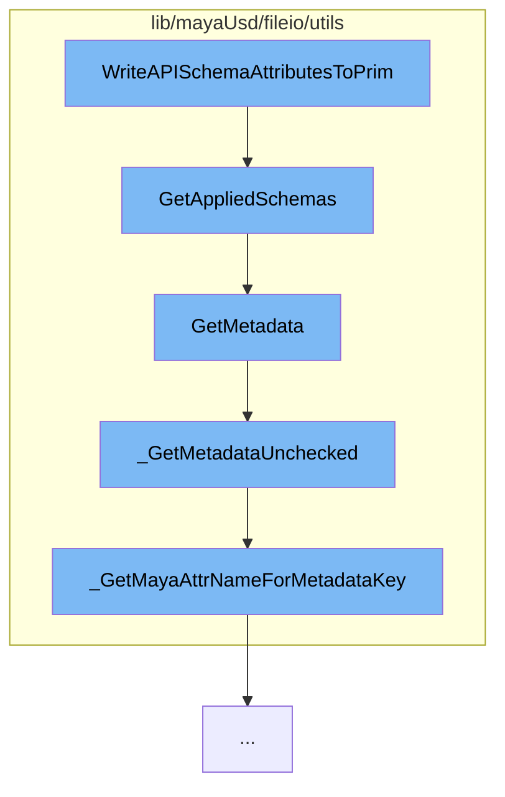

This document will cover the process of writing API schema attributes to a USD prim in the Maya-USD plugin. The process includes the following steps:

1. Retrieving applied schemas
2. Retrieving metadata
3. Unchecked retrieval of metadata
4. Getting Maya attribute name for metadata key.



<SwmSnippet path="/lib/mayaUsd/fileio/utils/adaptor.cpp" line="172">

---

# Retrieving applied schemas

The function `GetAppliedSchemas` retrieves the applied schemas for a given USD prim. It checks if there are any plugin adaptors that can be used and if the schema can be adapted, it is added to the result.

```c++
TfTokenVector UsdMayaAdaptor::GetAppliedSchemas() const
{
    if (!*this) {
        return TfTokenVector();
    }

    if (_jobImportArgs && !_handle.isValid()) {
        TF_CODING_ERROR("An importing adaptor should only use ApplySchema.");
        return TfTokenVector();
    }

    TfTokenVector result;

    // See if we have any plugin adaptors we could use:
    const MFnDependencyNode depNodeFn(_handle.object());
    const std::string       mayaTypeName(depNodeFn.typeName().asChar());
    for (auto&& adaptorEntry : UsdMayaSchemaApiAdaptorRegistry::Find(mayaTypeName)) {
        TfToken schemaName(adaptorEntry.first);
        if (_jobExportArgs
            && _jobExportArgs->includeAPINames.find(schemaName)
                == _jobExportArgs->includeAPINames.end()) {
```

---

</SwmSnippet>

<SwmSnippet path="/lib/mayaUsd/fileio/utils/adaptor.cpp" line="518">

---

# Retrieving metadata

The function `GetMetadata` retrieves the metadata for a given key. It checks if the key is registered and then retrieves the metadata unchecked.

```c++
bool UsdMayaAdaptor::GetMetadata(const TfToken& key, VtValue* value) const
{
    if (!*this) {
        return false;
    }

    if (!SdfSchema::GetInstance().IsRegistered(key)) {
        TF_CODING_ERROR("Metadata key '%s' is not registered", key.GetText());
        return false;
    }

    MFnDependencyNode node(_handle.object());
    return _GetMetadataUnchecked(node, key, value);
}
```

---

</SwmSnippet>

<SwmSnippet path="/lib/mayaUsd/fileio/utils/adaptor.cpp" line="472">

---

# Unchecked retrieval of metadata

The function `_GetMetadataUnchecked` retrieves the metadata without checking if the key is registered. It finds the Maya attribute name for the metadata key and retrieves the value.

```c++
static bool _GetMetadataUnchecked(const MFnDependencyNode& node, const TfToken& key, VtValue* value)
{
    VtValue fallback = SdfSchema::GetInstance().GetFallback(key);
    if (fallback.IsEmpty()) {
        return false;
    }

    std::string mayaAttrName = _GetMayaAttrNameForMetadataKey(key);
    MPlug       plug = node.findPlug(mayaAttrName.c_str());
    if (plug.isNull()) {
        return false;
    }

    TfType  ty = fallback.GetType();
    VtValue result = UsdMayaWriteUtil::GetVtValue(plug, ty, TfToken());
    if (result.IsEmpty()) {
        TF_RUNTIME_ERROR(
            "Cannot convert plug '%s' into metadata '%s' (%s)",
            plug.name().asChar(),
            key.GetText(),
            ty.GetTypeName().c_str());
```

---

</SwmSnippet>

<SwmSnippet path="/lib/mayaUsd/fileio/utils/adaptor.cpp" line="67">

---

# Getting Maya attribute name for metadata key

The function `_GetMayaAttrNameForMetadataKey` generates a valid Maya attribute name for a given metadata key.

```c++
static std::string _GetMayaAttrNameForMetadataKey(const TfToken& key)
{
    return TfStringPrintf("USD_%s", TfMakeValidIdentifier(key.GetString()).c_str());
}
```

---

</SwmSnippet>

&nbsp;

_This is an auto-generated document by Swimm AI 🌊 and has not yet been verified by a human_

<SwmMeta version="3.0.0" repo-id="Z2l0aHViJTNBJTNBbWF5YS11c2QlM0ElM0FnaWxhZG5hdm90" repo-name="maya-usd"><sup>Powered by [Swimm](/)</sup></SwmMeta>
