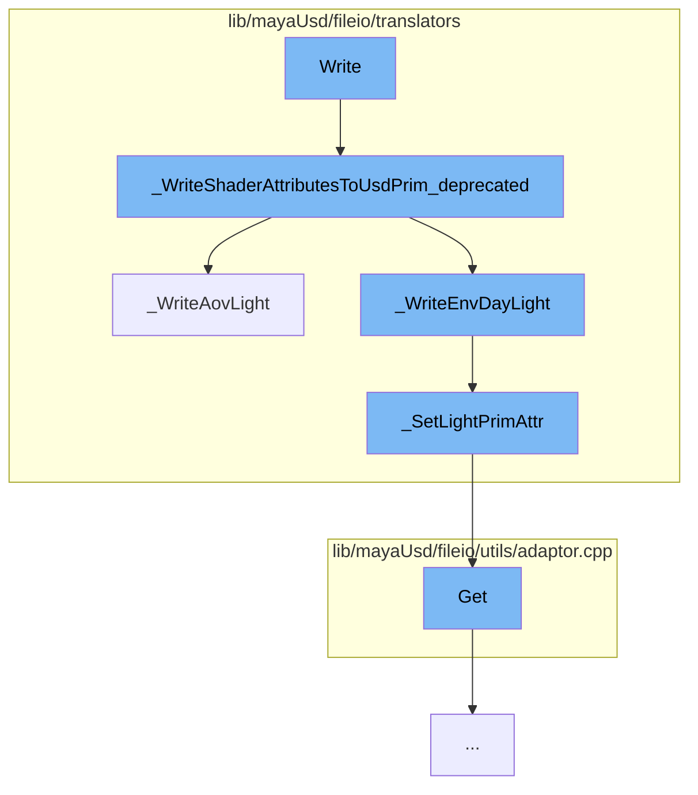

This document will cover the process of writing light attributes to a USD prim in the Maya USD plugin. The process involves the following steps:

1. Writing shader attributes to a USD prim
2. Writing AOV light attributes
3. Setting light prim attributes
4. Getting attribute values.



<SwmSnippet path="/lib/mayaUsd/fileio/translators/translatorRfMLightDeprecated.cpp" line="1818">

---

# Writing shader attributes to a USD prim

The function `_WriteShaderAttributesToUsdPrim_deprecated` is the entry point for writing shader attributes to a USD prim. It writes various light attributes such as intensity, exposure, color, temperature, and others to the USD prim.

```c++
void _WriteShaderAttributesToUsdPrim_deprecated(
    const MFnDependencyNode& depFn,
    UsdLuxLightAPI&          lightSchema)
{
    _WriteLightIntensity(depFn, lightSchema);
    _WriteLightExposure(depFn, lightSchema);
    _WriteLightDiffuse(depFn, lightSchema);
    _WriteLightSpecular(depFn, lightSchema);
    _WriteLightNormalizePower(depFn, lightSchema);
    _WriteLightColor(depFn, lightSchema);
    _WriteLightTemperature(depFn, lightSchema);

    // XXX: Light filters not yet implemented.
    // XXX: PxrMeshLight geometry not yet implemented.
    // XXX: PxrDomeLight portals not yet implemented.

    _WriteDistantLightAngle(depFn, lightSchema);

    _WriteLightTextureFile(depFn, lightSchema);

    _WriteAovLight(depFn, lightSchema);
```

---

</SwmSnippet>

<SwmSnippet path="/lib/mayaUsd/fileio/translators/translatorRfMLightDeprecated.cpp" line="560">

---

# Writing AOV light attributes

The function `_WriteAovLight` is called within `_WriteShaderAttributesToUsdPrim_deprecated` to write AOV light attributes. It checks if the light type is a AOV light and if so, it writes various AOV light attributes such as AOV name, in primary hit, in reflection, in refraction, and others to the USD prim.

```c++
// AOV LIGHT
static bool _WriteAovLight(const MFnDependencyNode& depFn, UsdLuxLightAPI& lightSchema)
{
    // Early out
    UsdPrim              lightPrim = lightSchema.GetPrim();
    static const TfType& usdSchemaBase = TfType::FindByName(_tokens->UsdSchemaBase);
    static const TfType& pxrAovLightType
        = usdSchemaBase.FindDerivedByName(_tokens->AovLightMayaTypeName);

    const TfType& lightType = usdSchemaBase.FindDerivedByName(lightPrim.GetTypeName());
    if (!lightType.IsA(pxrAovLightType)) {
        return false;
    }

    MStatus status;

    // AOV Name.
    MPlug aovNamePlug = depFn.findPlug(_tokens->AovNamePlugName.GetText(), &status);
    if (status != MS::kSuccess) {
        return false;
    }
```

---

</SwmSnippet>

<SwmSnippet path="/lib/mayaUsd/fileio/translators/translatorRfMLightDeprecated.cpp" line="124">

---

# Setting light prim attributes

The function `_SetLightPrimAttr` is called within `_WriteAovLight` to set the light prim attributes. It creates an attribute on the USD prim and sets its value.

```c++
// Adapted from UsdSchemaBase::_CreateAttr
static UsdAttribute _SetLightPrimAttr(
    UsdPrim&                lightPrim,
    TfToken const&          attrName,
    SdfValueTypeName const& typeName,
    bool                    custom,
    SdfVariability          variability,
    VtValue const&          defaultValue,
    bool                    writeSparsely)
{

    const TfToken& attrToken = _ShaderAttrName(_PrefixRiLightAttrNamespace(attrName));

    if (writeSparsely && !custom) {
        UsdAttribute attr = lightPrim.GetAttribute(attrToken);
        VtValue      fallback;
        if (defaultValue.IsEmpty()
            || (!attr.HasAuthoredValue() && attr.Get(&fallback) && fallback == defaultValue)) {
            return attr;
        }
    }
```

---

</SwmSnippet>

<SwmSnippet path="/lib/mayaUsd/fileio/utils/adaptor.cpp" line="1041">

---

# Getting attribute values

The function `Get` is called within `_SetLightPrimAttr` to get the value of the attribute. It retrieves the value of the attribute from the USD prim.

```c++
bool UsdMayaAttributeAdaptor::Get(VtValue* value) const
{
    if (!*this) {
        return false;
    }

#if PXR_VERSION < 2308
    VtValue result = UsdMayaWriteUtil::GetVtValue(_plug, _attrDef->GetTypeName());
#else
    VtValue result = UsdMayaWriteUtil::GetVtValue(_plug, _attrDef.GetTypeName());
#endif
    if (result.IsEmpty()) {
        return false;
    }

    *value = result;
    return true;
}
```

---

</SwmSnippet>

&nbsp;

_This is an auto-generated document by Swimm AI 🌊 and has not yet been verified by a human_

<SwmMeta version="3.0.0" repo-id="Z2l0aHViJTNBJTNBbWF5YS11c2QlM0ElM0FnaWxhZG5hdm90" repo-name="maya-usd"><sup>Powered by [Swimm](/)</sup></SwmMeta>
