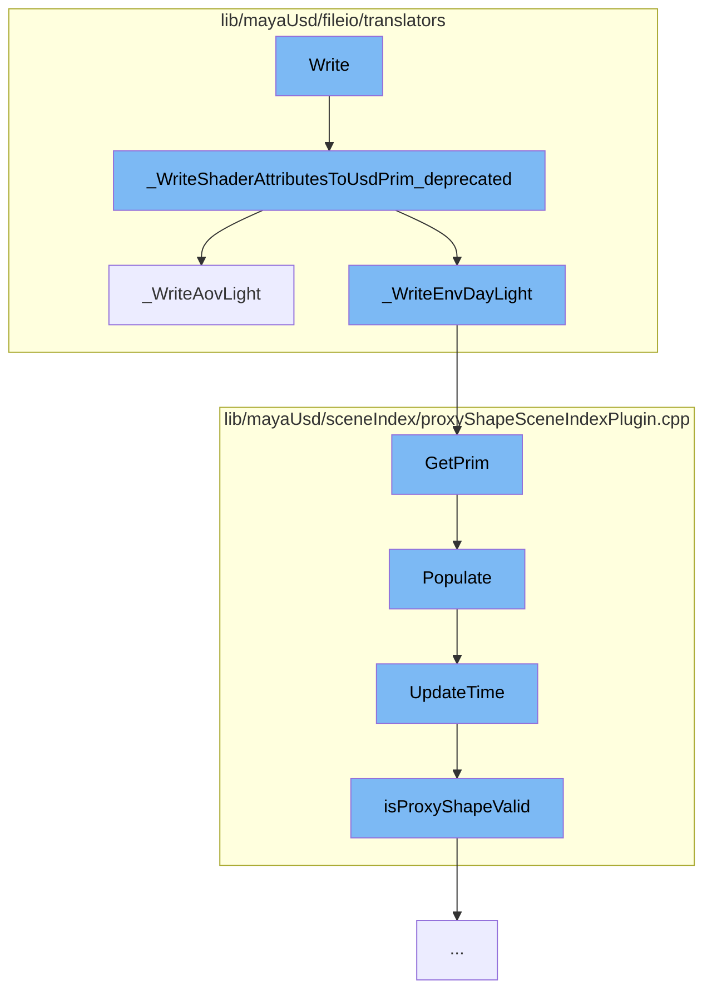

This document will cover the process of writing RenderMan for Maya (RfM) light attributes to a USD prim and updating the scene index. The process includes the following steps:

1. Writing shader attributes to a USD prim
2. Writing AOV light attributes
3. Writing environment daylight attributes
4. Getting the prim from the scene index
5. Populating the scene index
6. Updating the time in the scene index
7. Checking if the proxy shape is valid.



<SwmSnippet path="/lib/mayaUsd/fileio/translators/translatorRfMLightDeprecated.cpp" line="1818">

---

# Writing shader attributes to a USD prim

The function `_WriteShaderAttributesToUsdPrim_deprecated` is used to write various light attributes such as intensity, exposure, color, temperature, etc. to a USD prim. It also calls `_WriteAovLight` and `_WriteEnvDayLight` functions to write AOV light and environment daylight attributes respectively.

```c++
void _WriteShaderAttributesToUsdPrim_deprecated(
    const MFnDependencyNode& depFn,
    UsdLuxLightAPI&          lightSchema)
{
    _WriteLightIntensity(depFn, lightSchema);
    _WriteLightExposure(depFn, lightSchema);
    _WriteLightDiffuse(depFn, lightSchema);
    _WriteLightSpecular(depFn, lightSchema);
    _WriteLightNormalizePower(depFn, lightSchema);
    _WriteLightColor(depFn, lightSchema);
    _WriteLightTemperature(depFn, lightSchema);

    // XXX: Light filters not yet implemented.
    // XXX: PxrMeshLight geometry not yet implemented.
    // XXX: PxrDomeLight portals not yet implemented.

    _WriteDistantLightAngle(depFn, lightSchema);

    _WriteLightTextureFile(depFn, lightSchema);

    _WriteAovLight(depFn, lightSchema);
```

---

</SwmSnippet>

<SwmSnippet path="/lib/mayaUsd/fileio/translators/translatorRfMLightDeprecated.cpp" line="560">

---

# Writing AOV light attributes

The function `_WriteAovLight` is used to write AOV light attributes to a USD prim. It checks if the light type is AOV and if so, it writes various AOV light attributes such as AOV name, in primary hit, in reflection, in refraction, invert, on volume boundaries, use color, and use throughput.

```c++
// AOV LIGHT
static bool _WriteAovLight(const MFnDependencyNode& depFn, UsdLuxLightAPI& lightSchema)
{
    // Early out
    UsdPrim              lightPrim = lightSchema.GetPrim();
    static const TfType& usdSchemaBase = TfType::FindByName(_tokens->UsdSchemaBase);
    static const TfType& pxrAovLightType
        = usdSchemaBase.FindDerivedByName(_tokens->AovLightMayaTypeName);

    const TfType& lightType = usdSchemaBase.FindDerivedByName(lightPrim.GetTypeName());
    if (!lightType.IsA(pxrAovLightType)) {
        return false;
    }

    MStatus status;

    // AOV Name.
    MPlug aovNamePlug = depFn.findPlug(_tokens->AovNamePlugName.GetText(), &status);
    if (status != MS::kSuccess) {
        return false;
    }
```

---

</SwmSnippet>

<SwmSnippet path="/lib/mayaUsd/sceneIndex/proxyShapeSceneIndexPlugin.cpp" line="381">

---

# Getting the prim from the scene index

The function `GetPrim` is used to get the prim from the scene index. If the prim path is a special string `maya126790Workaround`, it populates the scene index.

```c++
// satisfying HdSceneIndexBase
HdSceneIndexPrim MayaUsdProxyShapeSceneIndex::GetPrim(const SdfPath& primPath) const
{
    // MAYA-126790 TODO: properly resolve missing PrimsAdded notification issue
    // https://github.com/PixarAnimationStudios/USD/blob/dev/pxr/imaging/hd/sceneIndex.cpp#L38
    // Pixar has discussed adding a missing overridable virtual function when an observer is
    // registered For now GetPrim called with magic string populates the scene index
    static SdfPath maya126790Workaround("maya126790Workaround");
    if (primPath == maya126790Workaround) {
        auto nonConstThis = const_cast<MayaUsdProxyShapeSceneIndex*>(this);
        nonConstThis->Populate();
        return HdSceneIndexPrim();
    }

    return _GetInputSceneIndex()->GetPrim(primPath);
}
```

---

</SwmSnippet>

<SwmSnippet path="/lib/mayaUsd/sceneIndex/proxyShapeSceneIndexPlugin.cpp" line="356">

---

# Populating the scene index

The function `Populate` is used to populate the scene index. It checks if the scene index is already populated. If not, it sets the stage and populates the scene index if the stage has children. It also updates the time in the scene index.

```c++
void MayaUsdProxyShapeSceneIndex::Populate()
{
    if (!_populated) {
        auto stage = _proxyShape->getUsdStage();
        if (TF_VERIFY(stage, "Unable to fetch a valid USDStage.")) {
            _usdImagingStageSceneIndex->SetStage(stage);
            // Check whether the pseudo-root has children
            if (!stage->GetPseudoRoot().GetChildren().empty())
            // MAYA-126641: Upon first call to MayaUsdProxyShapeBase::getUsdStage, the stage may be
            // empty. Do not mark the scene index as _populated, until stage is full. This is taken
            // care of inside MayaUsdProxyShapeSceneIndex::_StageSet callback.
            {
#if PXR_VERSION < 2305
                // In most recent USD, Populate is called from within SetStage, so there is no need
                // to callsites to call it explicitly
                _usdImagingStageSceneIndex->Populate();
#endif
                _populated = true;
            }
            // Set the initial time
            UpdateTime();
```

---

</SwmSnippet>

<SwmSnippet path="/lib/mayaUsd/sceneIndex/proxyShapeSceneIndexPlugin.cpp" line="325">

---

# Updating the time in the scene index

The function `UpdateTime` is used to update the time in the scene index. It checks if the proxy shape is valid and if so, it sets the time in the scene index.

```c++
void MayaUsdProxyShapeSceneIndex::UpdateTime()
{
    if (_usdImagingStageSceneIndex && _proxyShape && isProxyShapeValid()) {
        _usdImagingStageSceneIndex->SetTime(_proxyShape->getTime());
    }
}
```

---

</SwmSnippet>

<SwmSnippet path="/lib/mayaUsd/sceneIndex/proxyShapeSceneIndexPlugin.cpp" line="320">

---

# Checking if the proxy shape is valid

The function `isProxyShapeValid` is used to check if the proxy shape is valid. It returns true if the proxy shape is contained in the `MayaUsdProxyShapeStageExtraData`.

```c++
bool MayaUsdProxyShapeSceneIndex::isProxyShapeValid()
{
    return MayaUsdProxyShapeStageExtraData::containsProxyShape(*_proxyShape);
}
```

---

</SwmSnippet>

&nbsp;

_This is an auto-generated document by Swimm AI 🌊 and has not yet been verified by a human_

<SwmMeta version="3.0.0" repo-id="Z2l0aHViJTNBJTNBbWF5YS11c2QlM0ElM0FnaWxhZG5hdm90" repo-name="maya-usd"><sup>Powered by [Swimm](/)</sup></SwmMeta>
