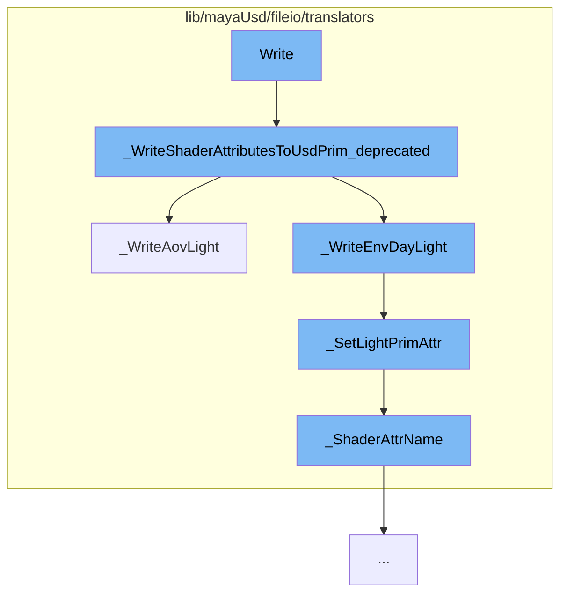

This document will cover the process of writing Renderman for Maya (RfM) light attributes to a USD Prim, which includes:

1. Writing shader attributes to USD Prim
2. Writing AOV light attributes
3. Setting light Prim attributes
4. Naming shader attributes.



<SwmSnippet path="/lib/mayaUsd/fileio/translators/translatorRfMLightDeprecated.cpp" line="1818">

---

# Writing shader attributes to USD Prim

The function `Write::lib/mayaUsd/fileio/translators/translatorRfMLight.cpp` starts the process by calling `_WriteShaderAttributesToUsdPrim_deprecated`. This function writes various light attributes such as intensity, exposure, color, temperature, etc. to the USD Prim.

```c++
void _WriteShaderAttributesToUsdPrim_deprecated(
    const MFnDependencyNode& depFn,
    UsdLuxLightAPI&          lightSchema)
{
    _WriteLightIntensity(depFn, lightSchema);
    _WriteLightExposure(depFn, lightSchema);
    _WriteLightDiffuse(depFn, lightSchema);
    _WriteLightSpecular(depFn, lightSchema);
    _WriteLightNormalizePower(depFn, lightSchema);
    _WriteLightColor(depFn, lightSchema);
    _WriteLightTemperature(depFn, lightSchema);

    // XXX: Light filters not yet implemented.
    // XXX: PxrMeshLight geometry not yet implemented.
    // XXX: PxrDomeLight portals not yet implemented.

    _WriteDistantLightAngle(depFn, lightSchema);

    _WriteLightTextureFile(depFn, lightSchema);

    _WriteAovLight(depFn, lightSchema);
```

---

</SwmSnippet>

<SwmSnippet path="/lib/mayaUsd/fileio/translators/translatorRfMLightDeprecated.cpp" line="560">

---

# Writing AOV light attributes

`_WriteShaderAttributesToUsdPrim_deprecated` then calls `_WriteAovLight`, which writes AOV light attributes to the USD Prim. These attributes include AOV name, in primary hit, in reflection, in refraction, invert, on volume boundaries, use color, and use throughput.

```c++
// AOV LIGHT
static bool _WriteAovLight(const MFnDependencyNode& depFn, UsdLuxLightAPI& lightSchema)
{
    // Early out
    UsdPrim              lightPrim = lightSchema.GetPrim();
    static const TfType& usdSchemaBase = TfType::FindByName(_tokens->UsdSchemaBase);
    static const TfType& pxrAovLightType
        = usdSchemaBase.FindDerivedByName(_tokens->AovLightMayaTypeName);

    const TfType& lightType = usdSchemaBase.FindDerivedByName(lightPrim.GetTypeName());
    if (!lightType.IsA(pxrAovLightType)) {
        return false;
    }

    MStatus status;

    // AOV Name.
    MPlug aovNamePlug = depFn.findPlug(_tokens->AovNamePlugName.GetText(), &status);
    if (status != MS::kSuccess) {
        return false;
    }
```

---

</SwmSnippet>

<SwmSnippet path="/lib/mayaUsd/fileio/translators/translatorRfMLightDeprecated.cpp" line="124">

---

# Setting light Prim attributes

The function `_SetLightPrimAttr` is called multiple times within `_WriteAovLight` to set the light Prim attributes. It creates an attribute on the USD Prim and sets its value.

```c++
// Adapted from UsdSchemaBase::_CreateAttr
static UsdAttribute _SetLightPrimAttr(
    UsdPrim&                lightPrim,
    TfToken const&          attrName,
    SdfValueTypeName const& typeName,
    bool                    custom,
    SdfVariability          variability,
    VtValue const&          defaultValue,
    bool                    writeSparsely)
{

    const TfToken& attrToken = _ShaderAttrName(_PrefixRiLightAttrNamespace(attrName));

    if (writeSparsely && !custom) {
        UsdAttribute attr = lightPrim.GetAttribute(attrToken);
        VtValue      fallback;
        if (defaultValue.IsEmpty()
            || (!attr.HasAuthoredValue() && attr.Get(&fallback) && fallback == defaultValue)) {
            return attr;
        }
    }
```

---

</SwmSnippet>

<SwmSnippet path="/lib/mayaUsd/fileio/translators/translatorRfMLightDeprecated.cpp" line="111">

---

# Naming shader attributes

The function `_ShaderAttrName` is used within `_SetLightPrimAttr` to construct the name of the shader attribute.

```c++
// clang-format on

static inline TfToken _ShaderAttrName(const std::string& shaderParamName)
{
    return TfToken(UsdShadeTokens->inputs.GetString() + shaderParamName);
}
```

---

</SwmSnippet>

&nbsp;

_This is an auto-generated document by Swimm AI 🌊 and has not yet been verified by a human_

<SwmMeta version="3.0.0" repo-id="Z2l0aHViJTNBJTNBbWF5YS11c2QlM0ElM0FnaWxhZG5hdm90" repo-name="maya-usd"><sup>Powered by [Swimm](/)</sup></SwmMeta>
