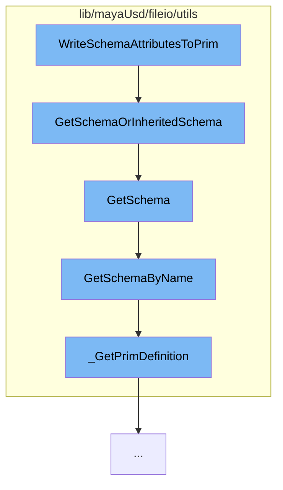

This document will cover the process of writing schema attributes to a USD (Universal Scene Description) Prim in the Maya-USD plugin. The process involves the following steps:

1. Invoking the WriteSchemaAttributesToPrim function
2. Getting the schema or inherited schema
3. Getting the schema by type
4. Getting the schema by name
5. Getting the prim definition.



<SwmSnippet path="/lib/mayaUsd/fileio/utils/writeUtil.cpp" line="1">

---

# Invoking the WriteSchemaAttributesToPrim function

The WriteSchemaAttributesToPrim function is the entry point for this process. It is responsible for initiating the process of writing schema attributes to a USD Prim.

```c++
//
```

---

</SwmSnippet>

<SwmSnippet path="/lib/mayaUsd/fileio/utils/adaptor.cpp" line="294">

---

# Getting the schema or inherited schema

The GetSchemaOrInheritedSchema function is called next. This function checks if the type is an API schema or a typed schema based on inheritance. If it is an API schema, it directly gets the schema. If it is a typed schema, it checks if the object type is a subtype of the given type and if so, gets the schema of the object type.

```c++
UsdMayaSchemaAdaptorPtr UsdMayaAdaptor::GetSchemaOrInheritedSchema(const TfType& ty) const
{
    if (!*this) {
        return nullptr;
    }

    if (ty.IsA<UsdAPISchemaBase>()) {
        // No "promotion" for API schemas.
        return GetSchema(ty);
    } else if (ty.IsA<UsdSchemaBase>()) {
        // Can "promote" typed schemas based on inheritance.
        const TfType objectType = GetUsdType();
        if (objectType.IsA(ty)) {
            return GetSchema(objectType);
        }
    }

    return nullptr;
}
```

---

</SwmSnippet>

<SwmSnippet path="/lib/mayaUsd/fileio/utils/adaptor.cpp" line="232">

---

# Getting the schema by type

The GetSchema function is then called. This function gets the schema type name and calls the GetSchemaByName function with this name.

```c++
UsdMayaSchemaAdaptorPtr UsdMayaAdaptor::GetSchema(const TfType& ty) const
{
    const TfToken usdTypeName = UsdSchemaRegistry::GetInstance().GetSchemaTypeName(ty);
    if (usdTypeName.IsEmpty()) {
        return nullptr;
    }

    return GetSchemaByName(usdTypeName);
}
```

---

</SwmSnippet>

<SwmSnippet path="/lib/mayaUsd/fileio/utils/adaptor.cpp" line="242">

---

# Getting the schema by name

The GetSchemaByName function is called next. This function checks if the adaptor is valid and if so, it gets the prim definition and returns the schema adaptor if it can adapt for export or import.

```c++
UsdMayaSchemaAdaptorPtr UsdMayaAdaptor::GetSchemaByName(const TfToken& schemaName) const
{
    if (!*this) {
        return nullptr;
    }

    if (_jobImportArgs && !_handle.isValid()) {
        TF_CODING_ERROR("An importing adaptor should only use ApplySchema.");
        return nullptr;
    }

    // If exporting, see if we have any plugin adaptors we could use:
    const MFnDependencyNode  depNodeFn(_handle.object());
    const std::string        mayaTypeName(depNodeFn.typeName().asChar());
    const UsdPrimDefinition* primDef = _GetPrimDefinition(*this, schemaName);

    for (auto&& schemaFn :
         UsdMayaSchemaApiAdaptorRegistry::Find(mayaTypeName, schemaName.GetString())) {
        if (!schemaFn) {
            // factories get nulled when their associated plugin unloads.
            continue;
```

---

</SwmSnippet>

<SwmSnippet path="/lib/mayaUsd/fileio/utils/adaptor.cpp" line="38">

---

# Getting the prim definition

Finally, the \_GetPrimDefinition function is called. This function checks if the schema name matches the object type name and if so, returns the prim definition.

```c++
PXR_NAMESPACE_OPEN_SCOPE

const UsdPrimDefinition*
_GetPrimDefinition(const UsdMayaAdaptor& adaptor, const TfToken& schemaName)
{
    const UsdSchemaRegistry& schemaReg = UsdSchemaRegistry::GetInstance();
    if (const UsdPrimDefinition* primDef = schemaReg.FindAppliedAPIPrimDefinition(schemaName)) {
        return primDef;
    }
    // Is this a typed schema?
    else if (const UsdPrimDefinition* primDef = schemaReg.FindConcretePrimDefinition(schemaName)) {
        // XXX
        // We currently require an exact type match instead of the polymorphic
        // behavior that actual USD schema classes implement. This is because
        // we can't currently get the prim definition from the schema registry
        // for non-concrete schemas like Imageable (see bug 160436). Ideally,
        // once that's resolved, we would cache a mapping of Maya types to all
        // compatible USD type names based on schema inheritance.
        // (In that future world, we'll also want to special case some schemas
        // like UsdGeomImageable to be "compatible" with all Maya nodes.)
        const TfToken objectTypeName = adaptor.GetUsdTypeName();
```

---

</SwmSnippet>

&nbsp;

_This is an auto-generated document by Swimm AI 🌊 and has not yet been verified by a human_

<SwmMeta version="3.0.0" repo-id="Z2l0aHViJTNBJTNBbWF5YS11c2QlM0ElM0FnaWxhZG5hdm90" repo-name="maya-usd"><sup>Powered by [Swimm](/)</sup></SwmMeta>
